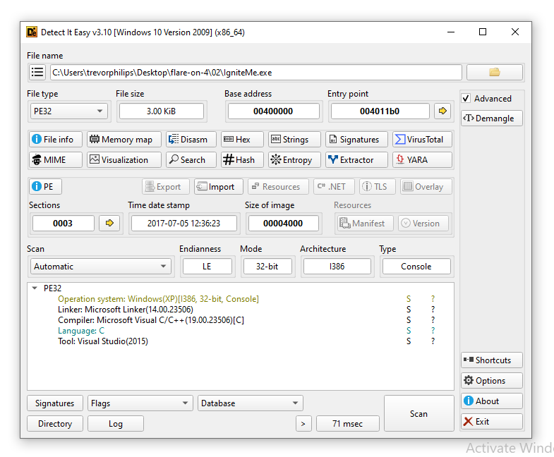
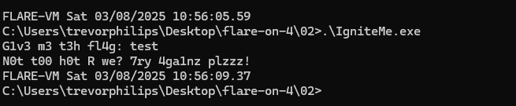
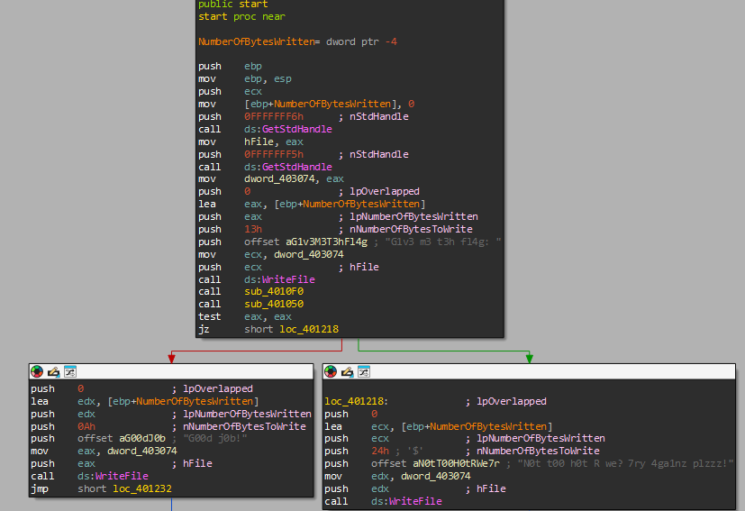
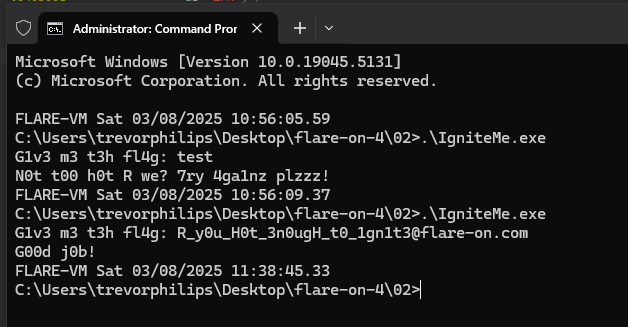

# Challenge 2

Challenge file given was exe executable, run with DIE will show this:



Running it with command prompt, will ask for user input:



We have to disassemble and reverse function that validate the string input
### Solution:
##### 1. Use IDA to decompile the executable to examine functions



Before the JZ instruction there are two function and within the start function there is no **ReadFile** function declare. So, we have to examine `sub_4010F0` and `sub_401050`. 

Here is the decompiled function of `sub_4010F0`:
```c
int sub_4010F0()
{
  unsigned int v0; // eax
  char Buffer[260]; // [esp+0h] [ebp-110h] BYREF
  DWORD NumberOfBytesRead; // [esp+104h] [ebp-Ch] BYREF
  unsigned int i; // [esp+108h] [ebp-8h]
  char v5; // [esp+10Fh] [ebp-1h]

  v5 = 0;
  for ( i = 0; i < 0x104; ++i )
    Buffer[i] = 0;
  ReadFile(hFile, Buffer, 0x104u, &NumberOfBytesRead, 0);
  for ( i = 0; ; ++i )
  {
    v0 = sub_401020(Buffer);
    if ( i >= v0 )
      break;
    v5 = Buffer[i];
    if ( v5 != 10 && v5 != 13 )
    {
      if ( v5 )
        byte_403078[i] = v5;
    }
  }
  return 1;
}
```

Here it uses **ReadFile** function and filter the user input to ignore newline (`\n` = 10) and carriage return (`\r` = 13) are ignored. Also use `byte_403078` to store the input. 

Take a look at the next function `sub_401050`:
```c
int sub_401050()
{
  int v1; // [esp+0h] [ebp-Ch]
  int i; // [esp+4h] [ebp-8h]
  unsigned int j; // [esp+4h] [ebp-8h]
  char v4; // [esp+Bh] [ebp-1h]

  v1 = sub_401020((int)byte_403078);
  v4 = sub_401000();
  for ( i = v1 - 1; i >= 0; --i )
  {
    byte_403180[i] = v4 ^ byte_403078[i];
    v4 = byte_403078[i];
  }
  for ( j = 0; j < 0x27; ++j )
  {
    if ( byte_403180[j] != (unsigned __int8)byte_403000[j] )
      return 0;
  }
  return 1;
}
```

This function uses the `byte_403078` perform rolling XOR since each bytes depends on the previous one. Then the result will compared to `byte_403000`. Next, with performing the same XOR operation against `byte_403000` will give us the correct input string value. For the **v4**, which is derived from **sub_401000** is a bitwise rotation left. The value return from **sub_401000** is `0x0004`.

##### 2. Use x32dbg to extract the encrypted byte_403000

From the .data section of the executable, the first 39 bytes is the XOR encrypted string, perform a reverse XOR. Here is the script to reverse the operation:

```go 
package main

import "fmt"

func main() {
	// Given byte_403000 array
	byte403000 := []byte{
		0x0D, 0x26, 0x49, 0x45, 0x2A, 0x17, 0x78, 0x44, 0x2B, 0x6C,
		0x5D, 0x5E, 0x45, 0x12, 0x2F, 0x17, 0x2B, 0x44, 0x6F, 0x6E,
		0x56, 0x09, 0x5F, 0x45, 0x47, 0x73, 0x26, 0x0A, 0x0D, 0x13,
		0x17, 0x48, 0x42, 0x01, 0x40, 0x4D, 0x0C, 0x02, 0x69,
	}

	// Initial key (v4)
	v4 := byte(0x04)

	// Reconstruct byte_403078
	byte403078 := make([]byte, len(byte403000))
	for i := len(byte403000) - 1; i >= 0; i-- {
		// Reverse the transformation: byte_403078[i] = byte_403000[i] ^ v4
		byte403078[i] = byte403000[i] ^ v4
		// Update v4 for the next iteration
		v4 = byte403078[i]
	}

	// Print the reconstructed byte_403078 as a string
	fmt.Printf("Reconstructed byte_403078 as string: %s\n", byte403078)
	fmt.Printf("Reconstructed byte_403078 as hex: % X\n", byte403078)
}
```

**Flag:** `R_y0u_H0t_3n0ugH_t0_1gn1t3@flare-on.com`


