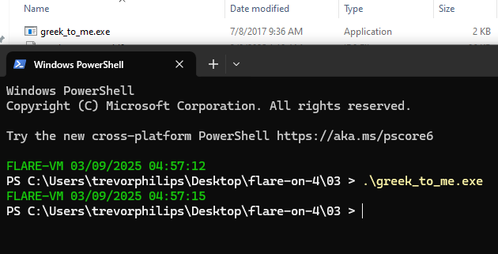
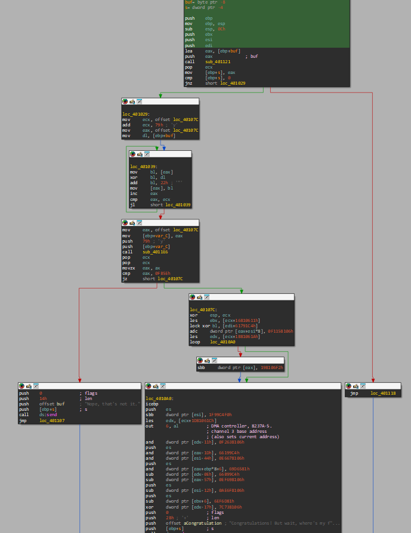
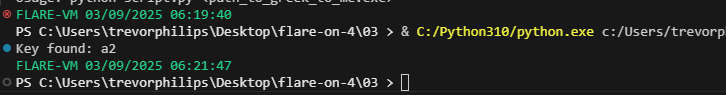
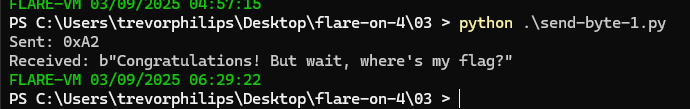
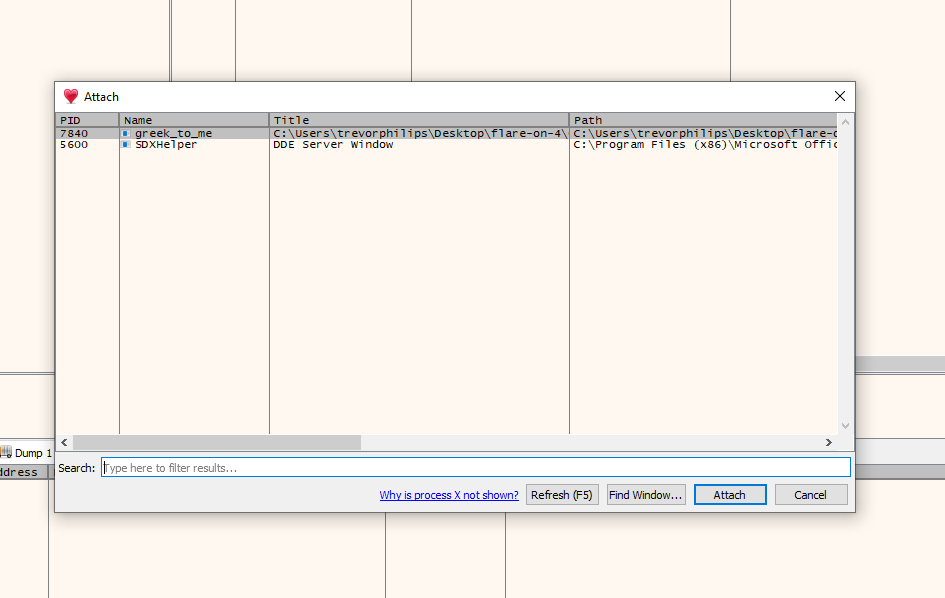
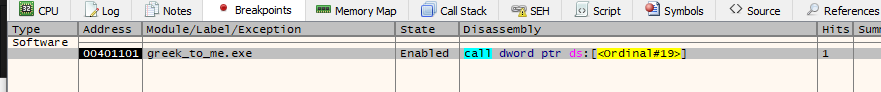
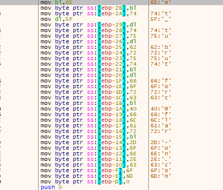

# Challenge 3
Challenge executable name is `greek_to_me.exe` and running without anything does not give any output. 



### Solution
##### 1. Decompile with IDA to check functions 
Here is the entry point of `start` which calls `sub_401008`:
```nasm
.text:00401000 ; int start()
.text:00401000                 public start
.text:00401000 start           proc near
.text:00401000                 call    sub_401008
.text:00401005                 xor     eax, eax
.text:00401007                 retn
.text:00401007 start           endp
```

Here is the graph showing the execution flow:

At the end, it will show an output string of "Nope, that's not it" or "Congratulations! But wait, ....". So, there must be input taken into and perform validation in order to return either string as a result. 

At `sub_401121`, it sets up a listening socket on `127.0.0.1` with port `2222 (0x8AE)`, accepts the connection and receive 4 byte of data. 

```nasm
.text:00401147 loc_401147:                             ; CODE XREF: sub_401121+1D↑j
.text:00401147                 push    esi
.text:00401148                 push    edi
.text:00401149                 push    6               ; protocol
.text:0040114B                 push    1               ; type
.text:0040114D                 push    2
.text:0040114F                 pop     edi
.text:00401150                 push    edi             ; af
.text:00401151                 call    ds:socket
.text:00401157                 mov     esi, eax
.text:00401159                 cmp     esi, 0FFFFFFFFh
.text:0040115C                 jz      short loc_4011D8
.text:0040115E                 push    offset cp       ; "127.0.0.1"
.text:00401163                 mov     [ebp+name.sa_family], di
.text:00401167                 call    ds:inet_addr
.text:0040116D                 push    8AEh            ; hostshort
.text:00401172                 mov     dword ptr [ebp+name.sa_data+2], eax
.text:00401175                 call    ds:htons
.text:0040117B                 mov     word ptr [ebp+name.sa_data], ax
.text:0040117F                 lea     eax, [ebp+name]
.text:00401182                 push    10h             ; namelen
.text:00401184                 push    eax             ; name
.text:00401185                 push    esi             ; s
.text:00401186                 call    ds:bind
.text:0040118C                 cmp     eax, 0FFFFFFFFh
.text:0040118F                 jz      short loc_4011D1
.text:00401191                 push    7FFFFFFFh       ; backlog
.text:00401196                 push    esi             ; s
.text:00401197                 call    ds:listen
.text:0040119D                 cmp     eax, 0FFFFFFFFh
.text:004011A0                 jz      short loc_4011D1
.text:004011A2                 push    0               ; addrlen
.text:004011A4                 push    0               ; addr
.text:004011A6                 push    esi             ; s
.text:004011A7                 call    ds:accept
.text:004011AD                 mov     edi, eax
.text:004011AF                 cmp     edi, 0FFFFFFFFh
.text:004011B2                 jz      short loc_4011D1
.text:004011B4                 push    0               ; flags
.text:004011B6                 push    4               ; len
.text:004011B8                 push    [ebp+buf]       ; buf
.text:004011BB                 push    edi             ; s
.text:004011BC                 call    ds:recv
.text:004011C2                 test    eax, eax
.text:004011C4                 jle     short loc_4011CA
.text:004011C6                 mov     eax, edi
.text:004011C8                 jmp     short loc_4011E0
```

After it received a byte, it will undergo a XOR transformation to modify memory at `loc_40107C`. This is continued for 121 bytes. Next, it performs a validation check through `sub_4011E6`. If it returns `64350`, the execution proceeds with further obfuscation. 

Here is the decompiled function: 
```c
s = sub_401121(buf);
  if ( !s )
    return 0;
  v2 = &loc_40107C;
  v3 = buf[0];
  do
  {
    *v2 = (v3 ^ *v2) + 34;
    ++v2;
  }
  while ( (int)v2 < (int)((_BYTE *)&loc_40107C + 121) );
  if ( (unsigned __int16)sub_4011E6(&loc_40107C, 121) == 64350 )
  {
    _EBX = *(_DWORD *)(v9 + 377554449);
    __asm { lock xor bl, [edi+61791C4h] }
    v5 = __CFADD__(*(_DWORD *)(8 * (_DWORD)a2 + 0xFB5E), -250248954);
    *(_DWORD *)(8 * (_DWORD)a2 + 0xFB5E) -= 250248954;
    if ( v9 == 1 )
    {
      v6 = v5 + 427886322;
      v5 = MEMORY[0xFB5E] < v6;
      MEMORY[0xFB5E] -= v6;
    }
    __asm { icebp }
    *a2 -= v5 + 530171120;
    v7 = *(_DWORD *)(v9 - 1 + 494994972);
    __outbyte(6u, 0x5Eu);
    *(_DWORD *)(v7 - 17) &= 0xF2638106;
    MEMORY[0xFB41] &= 0x66199C4u;
    *(a2 - 17) &= 0xE6678106;
    *(_DWORD *)(8 * (_DWORD)&savedregs + 64350 + 6) &= 0x69D6581u;
    *(_DWORD *)(v7 - 14) -= 107715012;
    MEMORY[0xFB07] += 278298362;
    *(_DWORD *)((char *)a2 - 18) += 1368424186;
    *(_DWORD *)(_EBX + 6) -= 116354433;
    *(_DWORD *)(v7 - 23) ^= 0x7C738106u;
    send(s, "Congratulations! But wait, where's my flag?", 43, 0);
  }
  else
  {
    send(s, "Nope, that's not it.", 20, 0);
  }
  closesocket(s);
  return WSACleanup();
}
```

**Key Takeaways:**
- Only one byte matters to validate `buf[0]` from the winsock function
- That byte influences all 121 bytes via XOR and addition
- Final validation depends on the transformed 121 bytes summing up correctly

**Exploitation Strategy:**
- Bruteforce the single byte `buf[0]` (0-255)
- Run the transformation
- Use debugger to extract flag value because it wouldnt print as string

##### 2. Script to bruteforce 
Here is the bruteforce script for finding the byte that return a string "Correct ...", with that byte we can use it again along with x32dbg.
```python
import sys
import os
import time
import socket

TCP_IP = "127.0.0.1"
TCP_PORT = 2222
BUFFER_SIZE = 1024

if len(sys.argv) < 2:
    print("Usage: python script.py <path_to_greek_to_me.exe>")
    sys.exit(1)

for i in range(256):
    os.startfile(sys.argv[1])  # Launch the application
    time.sleep(0.1)  # Allow it to start
    try:
        s = socket.socket(socket.AF_INET, socket.SOCK_STREAM)
        s.connect((TCP_IP, TCP_PORT))
        s.send(bytes([i]))  # Send a single byte
        data = s.recv(BUFFER_SIZE).decode(errors="ignore")
        s.close()
        if "Congratulations" in data:
            print("Key found: %x" % i)
            break
    except (socket.error, ConnectionRefusedError):

        print(f"Connection failed on attempt {i}. Retrying...")
```

The result:



So, the correct byte is `0xA2`, next we this byte we can test by sending it and check whether it return the correct message. Here is the script:

```python
import socket
import subprocess
import time

def start_application():
    # Start the application
    process = subprocess.Popen("greek_to_me.exe", creationflags=subprocess.CREATE_NEW_CONSOLE)
    time.sleep(2)  # Wait for the server to start
    return process

def test_connection():
    try:
        with socket.socket(socket.AF_INET, socket.SOCK_STREAM) as s:
            s.connect(("127.0.0.1", 2222))
            s.sendall(bytes([0xA2]))  # Sending the byte 0xA2
            print("Sent: 0xA2")
            
            data = s.recv(1024)
            print(f"Received: {data}")
    except ConnectionRefusedError:
        print("Connection failed. Ensure the application is running.")

def main():
    process = start_application()
    try:
        test_connection()
    finally:
        process.terminate()
        process.wait()

if __name__ == "__main__":
    main()
```

The result:


Next attach with x32dbg, sent a breakpoint at where it will return congratulations message and find the flag. We need to modify the script so that we have enough time to attach it to the debugger.

```python
import socket
import subprocess
import time
import os

def start_application():
    # Start the application
    process = subprocess.Popen("greek_to_me.exe", creationflags=subprocess.CREATE_NEW_CONSOLE)
    print(f"Application started with PID: {process.pid}")
    print("Waiting 15 seconds for you to attach debugger...")
    time.sleep(15)  # Wait longer to give you time to attach the debugger
    return process

def test_connection():
    try:
        with socket.socket(socket.AF_INET, socket.SOCK_STREAM) as s:
            s.connect(("127.0.0.1", 2222))
            s.sendall(bytes([0xA2]))  # Sending the byte 0xA2
            print("Sent: 0xA2")
            
            data = s.recv(1024)
            print(f"Received: {data}")
    except ConnectionRefusedError:
        print("Connection failed. Ensure the application is running.")

def main():
    process = start_application()
    try:
        test_connection()
        input("Press Enter to terminate the application...")
    finally:
        process.terminate()
        process.wait()

if __name__ == "__main__":
    main()
```

Attaching with x32dbg:


The breakpoint:


Got the flag:


**Flag:** `et_tu_brute_force@flare_on.com` 
