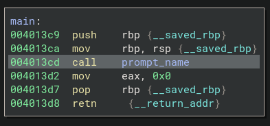
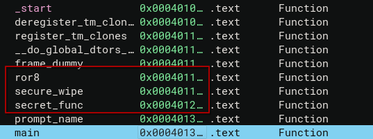
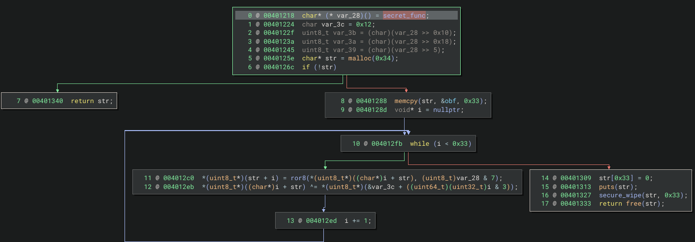

### hi

Challenge Description: Identify hidden function and access it using gdb 
Challenge File: o.exe 

##### Run file command on the binary and execute binary to understand its behaviour

```bash
$ file o.exe 
o.exe: ELF 64-bit LSB pie executable, x86-64, version 1 (SYSV), dynamically linked, interpreter /lib64/ld-linux-x86-64.so.2, BuildID[sha1]=50ac482d6d4b0e7681add7a7374a7740524cef28, for GNU/Linux 3.2.0, not stripped
```

```c
$ ./o.exe    
Enter your name: test  
Hi test
```

Based on our initial analysis, this is 64 bit ELF binary that takes in string input and print out with `Hi <input>`.
##### Identify hidden function in decompiler 




From the main function, it calls function **prompt_name** and prints out `Enter your name:` and use **fgets** to get input string, stores the reference address in RDI register and using **printf** to print it out. 
 
However from the symbol tree, there are three functions at lower address function that not been called. 




Here is how secret\_func() works:
1. reads its own function address and extract bytes at offset of `0x5, 0x10, 0x18` 
2. using **malloc** to allocate the encrypted flag from **obf** 
3. perform ROR & 7
4. XOR with rotated by with four local bytes 

Here is the simplified form
```c
str[i] = ROR8(str[i], rot) ^ key[i & 3]
```

Because the rotation amount depends on the function pointer, and the XOR key depends on specific bytes extracted from that same pointer or address, the decryption outputs relies on how the binary is loaded with dynamic addressing. So next task is to use gdb debugger to get runtime address of secret\_func and extract the obfuscated bytes of `obf`. 

##### Using gdb to find runtime function address of secret\_func

```
pwndbg> p secret_func 
$2 = {<text variable, no debug info>} 0x555555555208 <secret_func>
pwndbg> 
```

With that using a script to get the flag, here is the script:
```python
def ror8(value, shift):
    """rotate right 8-bit value"""
    shift = shift & 7
    return ((value >> shift) | (value << (8 - shift))) & 0xff

def decrypt_obf(obf_bytes, func_addr):
    """
    decrypt the obf data using the secret_func address
    
    args:
        obf_bytes: bytes object containing encrypted data
        func_addr: address of secret_func (e.g., 0x1208)
    """
    # generate key from function address (same as original code)
    # note: shifts are on the full value, then masked to byte
    key = [
        (func_addr >> 8) & 0xff,   # v1[0] - bits 8-15
        (func_addr >> 16) & 0xff,  # v1[1] - bits 16-23
        (func_addr >> 24) & 0xff,  # v1[2] - bits 24-31
        (func_addr >> 5) & 0xff    # v1[3] - bits 5-12
    ]
    rotation = func_addr & 7  # v3 - bits 0-2
    
    decrypted = bytearray()
    
    # apply decryption to each byte
    for i, byte in enumerate(obf_bytes):
        # rotate right
        rotated = ror8(byte, rotation)
        # xor with key
        decrypted.append(rotated ^ key[i & 3])
    
    return bytes(decrypted)

# actual data from the binary
if __name__ == "__main__":
    # runtime address of secret_func (from pwndbg)
    func_addr = 0x555555555208
    
    # obf bytes from 0x00402020
    obf_bytes = bytes([
        0x10, 0x1a, 0x1d, 0xa2, 0x67, 0x2e, 0x11, 0xa1, 
        0x36, 0x0a, 0x20, 0xcf, 0x21, 0x65, 0x39, 0xe6, 
        0x61, 0x31, 0x0a, 0xf9, 0x26, 0x0a, 0x22, 0xa1, 
        0x65, 0x3d, 0x65, 0xe5, 0x65, 0x0a, 0x16, 0xd8, 
        0x33, 0x62, 0x12, 0xc0, 0x65, 0x0a, 0x6a, 0xcf, 
        0x05, 0x66, 0x64, 0xa1, 0x0d, 0x11, 0x65, 0xfe, 
        0x61, 0x74, 0x28
    ])
    
    # verify with known plaintext
    known_plain = b"boh25{"
    print(f"known plaintext start: {known_plain}")
    print(f"encrypted start: {obf_bytes[:6].hex()}")
    
    # work backwards to find key
    print("\nreverse engineering key from known plaintext:")
    derived_key = []
    for i in range(6):
        # since rotation is 0 for addr 0x1208, encrypted = plain xor key[i&3]
        xor_val = obf_bytes[i] ^ known_plain[i]
        derived_key.append(xor_val)
        print(f"  byte {i}: 0x{obf_bytes[i]:02x} xor 0x{known_plain[i]:02x} = 0x{xor_val:02x}")
    
    print(f"\nderived key pattern: {[f'0x{k:02x}' for k in derived_key[:4]]}")
    print()
    
    print(f"function address: 0x{func_addr:x}")
    print(f"calculated key: {[f'0x{k:02x}' for k in [
        (func_addr >> 8) & 0xff,
        (func_addr >> 16) & 0xff, 
        (func_addr >> 24) & 0xff,
        (func_addr >> 5) & 0xff
    ]]}")
    print(f"rotation: {func_addr & 7}")
    print()
    
    print(f"encrypted obf ({len(obf_bytes)} bytes):")
    print(" ".join(f"{b:02x}" for b in obf_bytes))
    print()
    
    result = decrypt_obf(obf_bytes, func_addr)
    
    print(f"decrypted ({len(result)} bytes):")
    print("hex:", result.hex())
    print()
    
    try:
        decoded = result.decode('ascii')
        print("decrypted string:")
        print(decoded)
    except unicodedecodeerror:
        print("could not decode as ascii, raw bytes:")
        print(result)

```

**Flag:** `BOH25{D1d_u_s0lv3d_it_w17h0u7_CHa7GP7_?_W311_D0n3!}`

