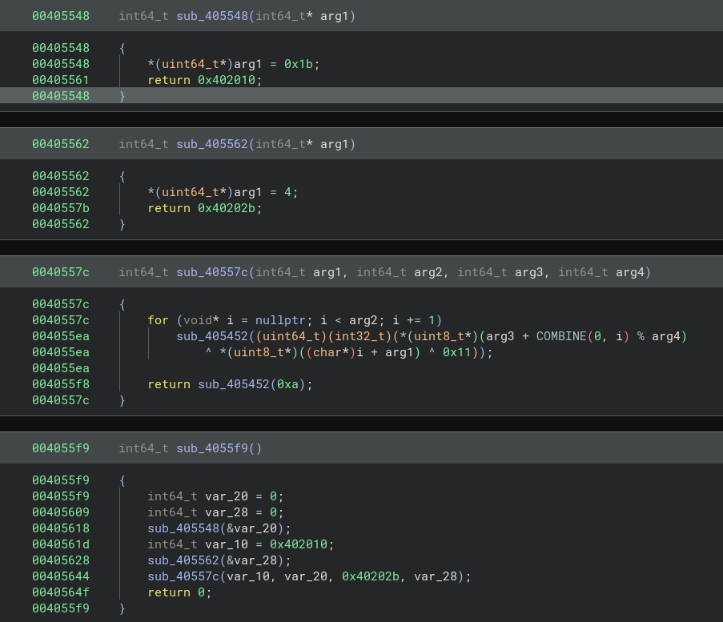

### Packed with Flag 

Challenge Description: The flag is packed in the binary, solve it 
Challenge File: challenge 

##### Run file command and execute the binary to understand its behaviour

```bash
$ file challenge    
challenge: ELF 64-bit LSB executable, x86-64, version 1 (SYSV), BuildID[sha1]=f67503cad304d4be6e786a1732fe93b10701487f, for GNU/Linux 3.2.0, statically linked, no section header
```

```bash 
./challenge    
** W]%%0))7T;:$:,S
```

Based on the output, the binary is ELF 64 bit and an encrypted string is printed out once executed

##### Decompile using Binary Ninja


Based on the decompiled C code, the function `sub_40557c` perform a simple XOR decryption with `0x11`. From the first two functions it returns a pointer to the encrypted data which located at address `0x402010` and `0x40202b` for the 4 byte XOR key. 

This is how the unpacker works:
1. At runtime, address of `0x402010` and `0x40202b` will contain the encrypted data and key. These are not available in decompiler as the binary is static and it is filled with zeros.  
2. The functions returns pointers so the decryption routine can read from those memory locations
3.  During runtime, it loads encrypted data into `0x402010` of 27 bytes along with the XOR key at `0x40202b` of 4 bytes during runtime 

Now since XOR key is 4 bytes and we know the plaintext of the flag start with `BOH25{` , bruteforce would be sufficient. 

First we hex the encrypted output and decrypted with bruteforce script:
```bash
./challenge | xxd -p  
2a2a20575d1e25250630292937543b3a1b110154243a032c0653150a
```

Here is the bruteforce script:
```python
def decrypt_with_key(encrypted_data, key):
    """Decrypt data with given key"""
    decrypted = bytearray()
    for i in range(len(encrypted_data)):
        byte = encrypted_data[i]
        byte ^= 0x11
        byte ^= key[i % len(key)]
        decrypted.append(byte)
    return bytes(decrypted)


def bruteforce_packed_elf(program_output):
    """
    Bruteforce 4-byte XOR key to decrypt the packed ELF output
    Expected format: BOH25{...}
    """
    print("=" * 70)
    print("Packed ELF Bruteforce - Looking for BOH25{...}")
    print("=" * 70)
    
    print(f"\nProgram output ({len(program_output)} bytes):")
    print(f"  Raw: {program_output}")
    print(f"  Hex: {program_output.hex()}")
    print(f"  Bytes: {' '.join(f'{b:02x}' for b in program_output)}")
    
    print(f"\nBruteforcing 4-byte XOR key...")
    print("Looking for: BOH25{{...}}")
    
    tested = 0
    found_flags = []
    
    # Bruteforce all possible 4-byte keys
    for a in range(256):
        for b in range(256):
            for c in range(256):
                for d in range(256):
                    test_key = bytes([a, b, c, d])
                    result = decrypt_with_key(program_output, test_key)
                    tested += 1
                    
                    try:
                        decoded = result.decode('ascii')
                        # Check if it matches flag format
                        if decoded.startswith('BOH25{') and decoded.endswith('}'):
                            found_flags.append((test_key, decoded))
                            print(f"\n{'='*70}")
                            print(f"✓ FOUND VALID FLAG #{len(found_flags)}!")
                            print(f"{'='*70}")
                            print(f"Key (hex):   {test_key.hex()}")
                            print(f"Key (bytes): {list(test_key)}")
                            print(f"Key (ascii): {repr(test_key)}")
                            print(f"Flag:        {decoded}")
                            print(f"{'='*70}\n")
                    except:
                        pass
                
                # Progress indicator
                if tested % 1000000 == 0:
                    print(f"  Tested: {tested:,} / 4,294,967,296 ({tested/42949672.96:.1f}%)", end='\r')
    
    print(f"\n\nTotal tested: {tested:,}")
    
    if found_flags:
        print(f"\n{'='*70}")
        print(f"SUMMARY: Found {len(found_flags)} valid flag(s)")
        print(f"{'='*70}")
        for i, (key, flag) in enumerate(found_flags, 1):
            print(f"{i}. Key: {key.hex()} → {flag}")
    else:
        print("\n⚠ No valid flags found with BOH25{{...}} format")
        print("   The output might need different processing")
    
    return found_flags


if __name__ == "__main__":
    # The hex-encoded output from running the packed binary
    hex_output = "2a2a20575d1e25250630292937543b3a1b110154243a032c0653150a"
    program_output = bytes.fromhex(hex_output)
    
    print("=" * 70)
    print("Fast Key Derivation from Known Plaintext")
    print("=" * 70)
    
    print(f"\nHex input: {hex_output}")
    print(f"Program output ({len(program_output)} bytes): {program_output}")
    
    known = b"BOH25{"
    print(f"\nKnown plaintext: {known}")
    print(f"Encrypted bytes:  {program_output[:len(known)].hex()}")
    
    # Derive key from known plaintext
    print(f"\nDeriving 4-byte key from first 6 characters...")
    derived_key_bytes = []
    
    for i in range(len(known)):
        # encrypted = plain ^ 0x11 ^ key[i%4]
        # key[i%4] = plain ^ 0x11 ^ encrypted
        key_byte = known[i] ^ 0x11 ^ program_output[i]
        derived_key_bytes.append(key_byte)
        print(f"  Pos {i}: '{chr(known[i])}' (0x{known[i]:02x}) ^ 0x11 ^ 0x{program_output[i]:02x} = 0x{key_byte:02x}")
    
    # We have 6 bytes but key is 4 bytes (repeating)
    # Positions 0,1,2,3,4,5 map to key[0],key[1],key[2],key[3],key[0],key[1]
    # So derived_key_bytes[0] and [4] should be same (both key[0])
    # And derived_key_bytes[1] and [5] should be same (both key[1])
    
    print(f"\nKey verification (should repeat every 4 bytes):")
    print(f"  Key[0] candidates: 0x{derived_key_bytes[0]:02x} (pos 0), 0x{derived_key_bytes[4]:02x} (pos 4)")
    print(f"  Key[1] candidates: 0x{derived_key_bytes[1]:02x} (pos 1), 0x{derived_key_bytes[5]:02x} (pos 5)")
    
    # Check if they match
    if derived_key_bytes[0] == derived_key_bytes[4] and derived_key_bytes[1] == derived_key_bytes[5]:
        print(f"  ✓ Keys match! Valid decryption.")
        key = bytes(derived_key_bytes[:4])
    else:
        print(f"  ⚠ Keys don't match - trying both possibilities...")
        # Try first 4 bytes
        key = bytes(derived_key_bytes[:4])
    
    print(f"\nFinal key: {key.hex()} ({list(key)})")
    print(f"Key as ASCII: {repr(key)}")
    
    # Decrypt full message
    result = decrypt_with_key(program_output, key)
    
    print(f"\n{'='*70}")
    print("DECRYPTED RESULT")
    print(f"{'='*70}")
    try:
        decoded = result.decode('ascii')
        print(f"Flag: {decoded}")
        
        if decoded.startswith('BOH25{') and decoded.endswith('}'):
            print(f"✓ Valid flag format!")
        else:
            print(f"⚠ Flag format looks incorrect")
    except:
        print(f"Raw bytes: {result.hex()}")
        print(f"Raw: {result}")
    
    print(f"{'='*70}")
```

**Flag:** `BOH25{M@nUAL_1S_sti1L_kIn6}`
