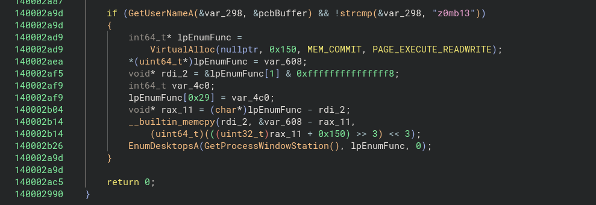
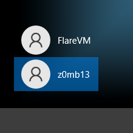
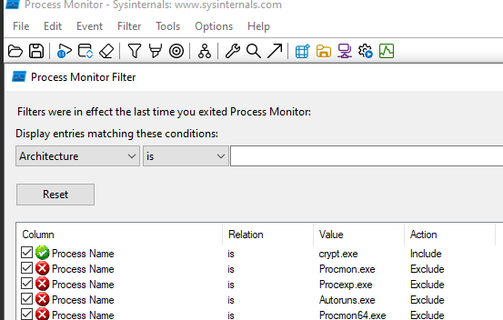
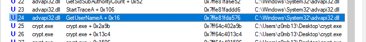
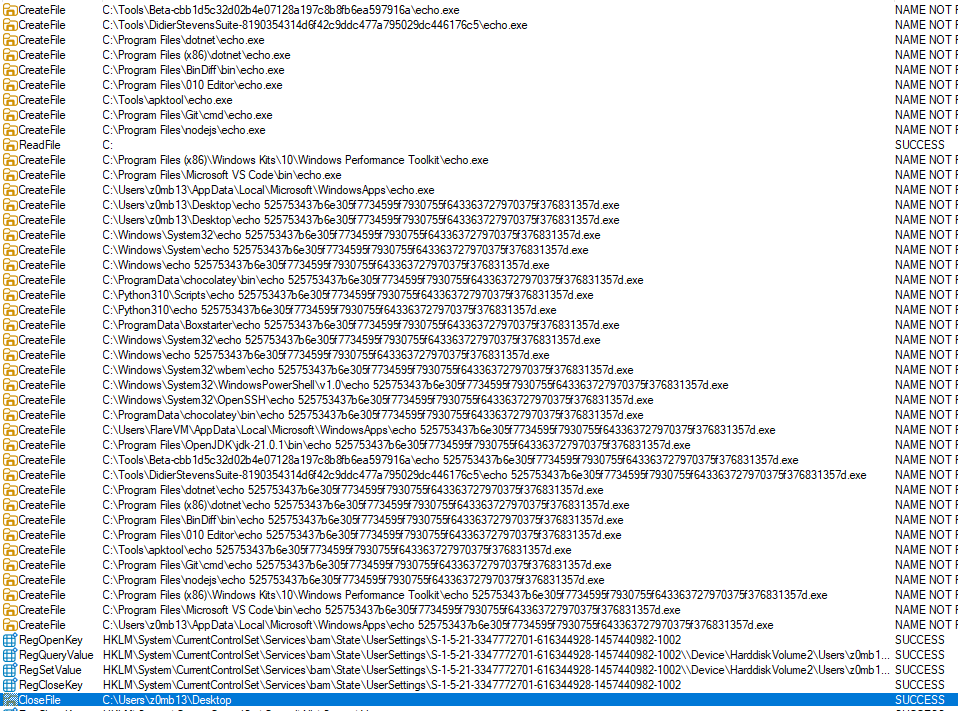
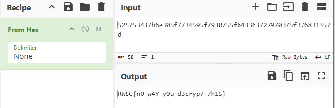

### 3. RC6

For this challenge, I unable to decrypt shellcode with script, however my approach is more towards malware behavior analysis as it check for the username `z0mb13` and runs procmon and check what is the shellcode's behaviour with `EnumDesktopA`

To solve it create another user profile with the name `z0mb13`

Set up capture file for process name with `crypt.exe`

GetUserName invoked:

And before crypt.exe closed, here are the processes:

There is a noticeable repetitive string in the search path with `echo 525753437b6e305f7734595f7930755f643363727970375f376831357d.exe`

Decode the hex string with give us the flag:

**Flag:** `RWSC{n0_w4Y_y0u_d3cryp7_7h15}`

Reference: [https://cocomelonc.github.io/tutorial/2022/06/27/malware-injection-20.html](https://cocomelonc.github.io/tutorial/2022/06/27/malware-injection-20.html)
