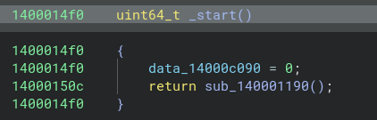
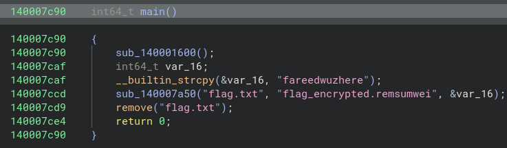

# rensumwei 

- Base address: `0000000140000000`
- Entry point: `00000001400014f0`



### 1. Analyze main function 
main function: `0000000140007c90`


At address `0000000140007ccd`, it called a functions that takes in argument of `flag.txt`, `flag_encrypted.remsumwei` and `fareedwuzhere`

### 2. Analyze subfunction at address 0000000140007ccd
Called function decompiled code:
  ```c
  void __fastcall sub_140007A50(const char *a1, const char *a2, const char *a3)
{
  FILE *v5; // r12
  FILE *v6; // r15
  size_t v7; // rdi
  void *v8; // rax
  void *v9; // r13
  void *v10; // r14
  size_t v11; // rax
  __int64 v12; // rax
  __int64 v13; // rax

  v5 = fopen(a1, "rb");
  if ( !v5 )
  {
    v12 = off_140008090();
    sub_1400079B0(v12, "Error opening input file.\n");
    exit(1);
  }
  v6 = fopen(a2, "wb");
  if ( !v6 )
  {
    v13 = off_140008090();
    sub_1400079B0(v13, "Error opening output file.\n");
    fclose(v5);
    exit(1);
  }
  fseek(v5, 0, 2);
  v7 = ftell(v5);
  fseek(v5, 0, 0);
  v8 = malloc(v7);
  v9 = v8;
  if ( !v8 )
  {
    fclose(v5);
    fclose(v6);
    exit(1);
  }
  fread(v8, 1u, v7, v5);
  v10 = malloc(0x100u);
  if ( !v10 )
  {
    fclose(v5);
    fclose(v6);
    free(v9);
    exit(1);
  }
  v11 = strlen(a3);
  sub_140007C00(a3, v11, v10);
  sub_1400079E0(v9, (unsigned int)v7, v9, v10);
  fwrite(v9, 1u, v7, v6);
  fclose(v5);
  fclose(v6);
  free(v9);
  free(v10);
}
  ```

Called function at `0000000140007b1e` which takes in arguments of the string `fareedwuzhere`, strlen of `fareedwuzhere` and `malloc(0x100)`. Here is the decompiled C code:

```c
  _BYTE *__fastcall sub_140007C00(__int64 a1, int a2, __int64 a3)
{
  __int64 i; // rax
  __int64 v5; // rcx
  unsigned int v6; // ebx
  char v7; // r9
  _BYTE *result; // rax

  for ( i = 0; i != 256; ++i )
    *(_BYTE *)(a3 + i) = i;
  v5 = 0;
  LOBYTE(v6) = 0;
  do
  {
    v7 = *(_BYTE *)(a3 + v5);
    v6 = (unsigned __int8)(v6 + v7 + *(_BYTE *)(a1 + (int)v5 % a2));
    result = (_BYTE *)(a3 + v6);
    *(_BYTE *)(a3 + v5++) = *result;
    *result = v7;
  }
  while ( v5 != 256 );
  return result;
}
  ```

This function is performing RC4 encryption using the key of `fareedwuzhere` with KSA + PRGA

Here is the decryption code:
```python
def rc4_decrypt(key, data):
    # KSA - Key Scheduling Algorithm
    S = list(range(256))
    j = 0
    for i in range(256):
        j = (j + S[i] + key[i % len(key)]) % 256
        S[i], S[j] = S[j], S[i]
    
    # PRGA - Pseudo-Random Generation Algorithm
    i = 0
    j = 0
    result = []
    for byte in data:
        i = (i + 1) % 256
        j = (j + S[i]) % 256
        S[i], S[j] = S[j], S[i]
        keystream_byte = S[(S[i] + S[j]) % 256]
        result.append(byte ^ keystream_byte)
    
    return bytes(result)

# The key from the binary
key = b"fareedwuzhere"

# Read the encrypted file
with open("flag_encrypted.remsumwei", "rb") as f:
    encrypted = f.read()

# Decrypt
decrypted = rc4_decrypt(key, encrypted)
print(decrypted.decode())
```

**Flag**: `RWSC{rc4_e4sy_p3asy_cryp7}`

