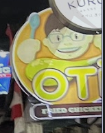
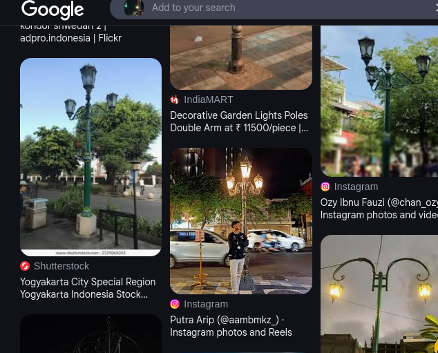
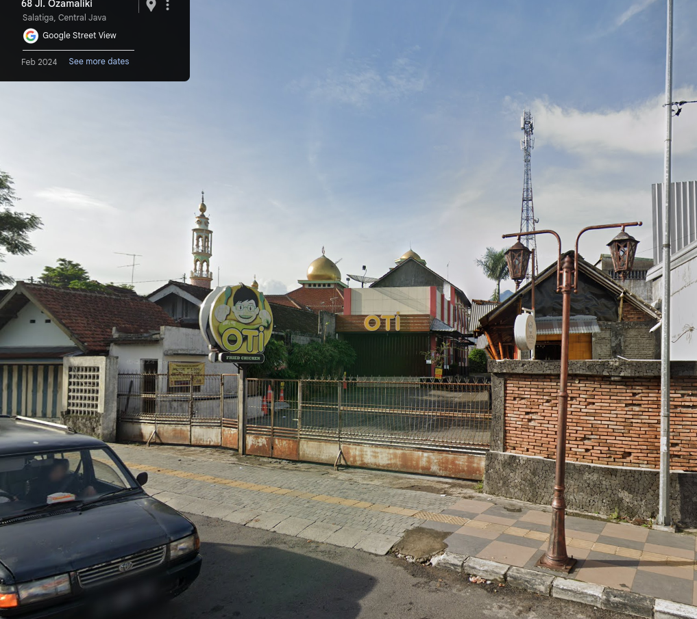

遠くまで歩き、夕闇に消える足跡  
煌めく街頭が、夜の街を飾る  
傍らの道には、バイクの群れが過ぎ去り  
風の音だけが残る

光と影の中、ふと立ち止まり思う  
私は今、どこにいるんだろう

フラグフォーマットはこの人が立っている場所の`TsukuCTF25{緯度_経度}`です。ただし、緯度および経度は小数点以下五桁目を切り捨てたものとします。

.png)

### 1. Gather clue about the cartoon face brand signboard

This image is a signboard banner for [OTI Fried Chicken](https://otifriedchicken.com/) outlet. However, there are many outlets scatters all over Indonesia. Next, we will use the lamp post which seems unique and different. It maybe could narrow down our findings.

### 2. Reverse image search the lamp post

Some result are repetitively stating it can be found in Yogyakarta. Now we can combine both clues and narrow down our searches.

### 3. Narrow down our search
By searching **"OTI Fried Chicken Yogjakarta"**, Google Maps will show 4 places as result. We can use Google Street View function to verify it matches the challenge image. At the end, you will reach [here](https://maps.app.goo.gl/XHyD8cZfN6ordmf77)

**FLAG:** `TsukuCTF25{-7.31891_110.49697}`