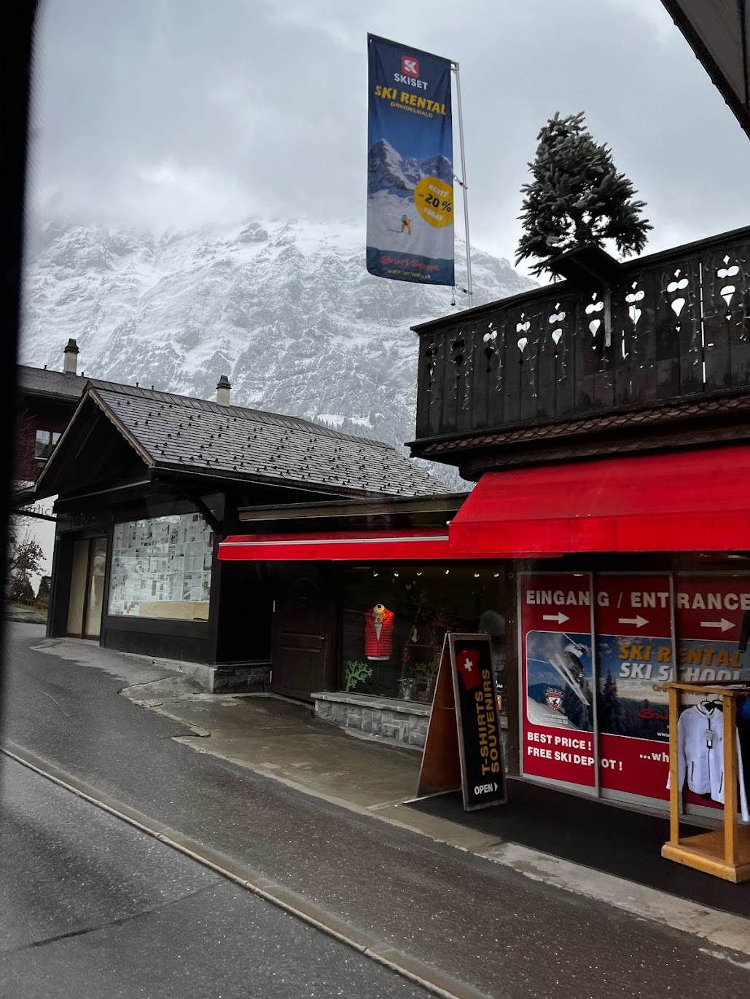

# schnee

素敵な雪山に辿り着いた！スノーボードをレンタルをして、いざ滑走！  
フラグフォーマットは写真の場所の座標の小数点第4位を四捨五入して、小数第3位までを`TsukuCTF25{緯度_経度}`の形式で記載してください。  
例: `TsukuCTF25{12.345_123.456}`

### 1. Gather clues of possible hints of locations

The banner showing SKISET, probably a ski rental shop in Grindelwald, Switzerland.

### 2. Narrow down possible locations
With Google search, there will multiple outlets of SKISET. The closest with image is from an [Instagram post](https://www.instagram.com/p/DAoNti2TZWd/?img_index=7)

Here is the Google Maps location: [https://maps.app.goo.gl/7ufBTH3UazmwmZh3A](https://maps.app.goo.gl/7ufBTH3UazmwmZh3A)

**FLAG**: `TsukuCTF{46.624_8.039}`

