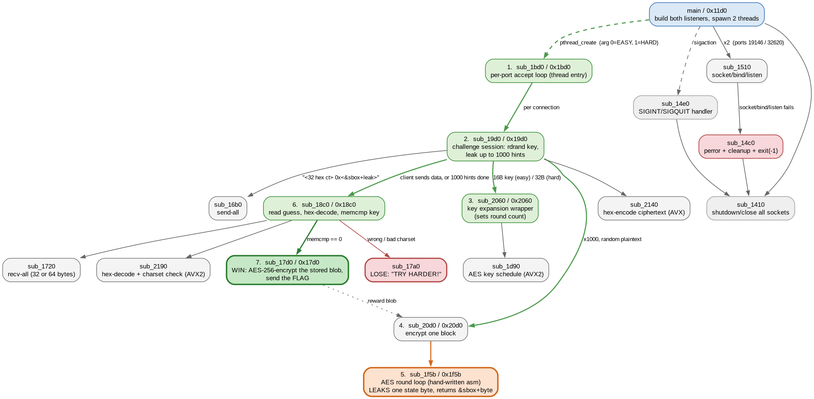

# cryptoleaks (EASY)

"I'm waiting for you with a simple challenge: can you guess my key? I'll even make it easy on you by leaking hints!"

- Category: rev / crypto
- Difficulty: 3.0
- Challenge author: 4aca7f6c
- Platform: Linux x86-64 (ELF PIE, dynamically linked, stripped), needs AVX2 + RDRAND

Unusual shape for a crackme: there is no password prompt and nothing to patch. The binary is a **TCP server** that picks a fresh AES key from `RDRAND` on every connection, then volunteers a thousand encryptions of random plaintexts — each one accompanied by a leaked byte of internal cipher state. You have to guess the key, and the author is explicit that patching or pulling the flag out of the file doesn't count. So the whole challenge is a side-channel attack: the crackme *is* the leaky implementation.

This writeup covers EASY (AES-128) on port 19146. [HARD](../4aca7f6c-cryptoleaks-hard/) is the same binary's second port, where the leak alternates between two rounds.

### Solution:

##### 1. It isn't a prompt, it's a server

`file` says stripped PIE, and the import list settles what kind of program it is before any decompilation:

```
socket  setsockopt  bind  listen  accept  send  recv  poll  shutdown
pthread_create  pthread_join  pthread_mutex_lock  memcmp  strnlen
```

`.rodata` carries `[EASY] `, `[HARD] `, `TRY HARDER!`, and `Correct! We have a WINNER!`. `main` (`sub_11d0`) wires it up:

```c
dat_6084 = sub_1510(0x4aca);            // listen on 19146
dat_6080 = sub_1510(0x7f6c);            // listen on 32620
v5 = 0; v6 = 1;
pthread_create(0x6070, 0, sub_1bd0, &v5);   // EASY thread
pthread_create(0x6068, 0, sub_1bd0, &v6);   // HARD thread
```

`sub_1510` is a plain `socket`/`setsockopt`/`bind`/`listen` helper taking a port, and the two ports are `0x4aca` and `0x7f6c` — the author's own handle, `4aca7f6c`, split in half. Both threads run the same accept loop `sub_1bd0`, which differs only by that `0`/`1` mode flag, and hands each connection to `sub_19d0`.

##### 2. One connection, one key, a thousand free encryptions

`sub_19d0(fd, mode)` is the whole game:

```c
do { v4  = rdrand(); } while (!rdrandIsValid());   // key bytes 0..7
do { v16 = rdrand(); } while (!rdrandIsValid());   // key bytes 8..15
if (a1) {                                          // HARD only: 16 more
  do { v17 = rdrand(); } while (!rdrandIsValid());
  do { v18 = rdrand(); } while (!rdrandIsValid());
  sub_2060(v5, &v4, 0x20);                         // AES-256 key schedule
} else {
  sub_2060(v5, &v4, 0x10);                         // AES-128 key schedule
}
sub_1630("Challenge prepared. Leaking hints....");
v11 = 1000;
do {
  do { v7  = rdrand(); } while (!rdrandIsValid()); // random plaintext
  do { v15 = rdrand(); } while (!rdrandIsValid());
  v2 = sub_20d0(v5, &v7, v6);                      // encrypt one block
  sub_2140(v9, v6);                                // hex-encode ciphertext
  __snprintf_chk(v8, 0x20, 1, 0x20, " %p\n", v2);  // <-- format the return value
  do { v1 = poll(&v10, 1, 10); } while (!v1);      // 10 ms: has the client spoken?
  if (v14 & 1) break;
  v3 = strnlen(v9, 0x40);
  if (sub_16b0(a0, v9, v3)) return 0xffffffff;
  v11 -= 1;
} while (v11);
return sub_18c0(a0, v12, a1);                      // read the guess and check it
```

So: one random key per connection, up to 1000 encryptions of random plaintexts, and the loop stops early the moment we send anything. `sub_18c0` then reads 32 hex characters (64 on HARD), decodes them, and `memcmp`s against the raw key — no transformation, the guess *is* the key.



The graph comes from kuna's own decompilation rather than a second disassembler: `decompile-all --json` carries every function's C in a `code` field, so scanning each body for other functions' names gives the call edges, and a short pass emits DOT for Graphviz.

```bash
kuna decompile-all ./cryptoleaks --json > all.json
# scan each function's "code" for callee names -> cg.dot
dot -Tpng -Gdpi=140 cg.dot -o callgraph.png
```

That detour is worth it here. `r2 -A` finds 48 functions to kuna's 54, and two of the missing ones matter: `sub_1bd0` — the accept loop, the backbone of the entire program — and `sub_14e0`, the signal handler. Neither is ever the target of a call or jump; they exist only as function pointers handed to `pthread_create` and `sigaction`. radare2 discovers functions by following cross-references, so an address that only ever travels in a register is invisible to it, and an r2-only call graph is missing the trunk of the tree.

##### 3. The hint says more than it means to

Look again at where the two buffers go. `sub_2140` hex-encodes, and its tail is two vector stores and nothing else:

```
2171:  vpunpcklbw %xmm2,%xmm3,%xmm0
2175:  vpunpckhbw %xmm2,%xmm3,%xmm1
2179:  vmovdqu    %xmm0,(%rdi)
217d:  vmovdqu    %xmm1,0x10(%rdi)
2185:  ret
```

Exactly 32 bytes of hex, **no NUL terminator**. And in `sub_19d0` the two buffers are neighbours:

```
1a75:  lea 0x170(%rsp),%rbp          <- hex ciphertext buffer (32 bytes)
1a60:  lea 0x190(%rsp),%rax          <- snprintf(" %p\n") destination
       ...
1b17:  mov $0x40,%esi
1b1c:  mov %rbp,%rdi
1b1f:  call strnlen@plt              <- strnlen(hexbuf, 0x40)
1b2d:  call 16b0                     <- send(fd, hexbuf, len)
```

`0x170 + 32 = 0x190`. The hex buffer runs straight into the `%p` string with no terminator between them, so `strnlen` walks across both and `send` ships the pair. The `%p` was presumably meant as a debug line the client never sees; instead every hint is:

```
$ nc 127.0.0.1 19146
708767a3ec6e970b942c39b0fe93f22a 0x55c3a54017be
07afc212153bd3959d52cffae8da4c68 0x55c3a54017bf
dd0858364daf484e41e4e192f8587f3f 0x55c3a540186f
```

##### 4. What that pointer is

The pointer is whatever `sub_20d0` left in `rax`, which is the return value of the hand-written assembly core `sub_1f5b`:

```c
v6 = 0;
v1 = *a1;                                  // plaintext state
do { v7 = rdrand(); } while (!rdrandIsValid());
v8 = v7;
if (0xc <= a2) { v8 = v7 >> 1 & 0x7f; v6 = v7 & 1; }   // 12+ rounds only
v9 = (unsigned long)(v8 & 0xf);            // random byte index 0..15
while (true) {
  a2 -= 1;
  *a1 = v1 ^ *a0;                          // AddRoundKey
  if (a2 == v6) v9 = (*a1)[v9];            // <-- LEAK: state[idx] replaces idx
  ... SubBytes via table at 0x3790 ...
  v1 = vpshufb_avx(*a1, dat_3890);         // ShiftRows
  if (!a2) break;
  ... MixColumns ...
}
*a1 = v1 ^ *a0;                            // final AddRoundKey
return v9 + 0x3790;                        // &sbox + the leaked byte
```

The loop is AES restructured so each iteration is `AddRoundKey; SubBytes; ShiftRows; [MixColumns unless last]`, with a trailing `AddRoundKey`. With `a2 = 10` at entry, iteration `k` sees `a2 = 10 - k`, so the guard `a2 == v6` fires on iteration 10 — and `0xc <= a2` is false for AES-128, so `v6` stays `0` and `v8` is the full random word.

**The leaked byte is one byte, at a uniformly random position, of the state entering the last round's SubBytes.** The tables confirm plain textbook AES: `0x3790` is the standard S-box (`63 7c 77 7b f2 6b 6f c5 ...`), `0x3890` is `[0,5,10,15,4,9,14,3,8,13,2,7,12,1,6,11]` — the ShiftRows byte permutation — and `0x38a0` holds the usual Rcon words. Reading the AVX MixColumns confirms it too: `vpshufb` of a `0x1b`-filled register by the state selects `0x1b` exactly where the high bit is set, which is the conditional reduction of `xtime`.

##### 5. One pointer defeats PIE

The leak arrives as an absolute address, but the S-box lives at image offset `0x3790` and the load base is page-aligned, so `&sbox` always ends in `0x790`. The leak adds at most `0xff`, and `0x790 + 0xff = 0x88f` never reaches `0x1000` — the value can't cross into the next page. So a single hint pins the base down and every subsequent leak is exact:

```python
sbox_addr = (ptr & ~0xfff) | 0x790
leak = ptr - sbox_addr                      # always in [0, 255]
```

##### 6. A free correctness oracle before attacking

The attack is built on a *model* of the cipher, and a wrong model produces confident nonsense. This binary hands you a way to check it for nothing. `sub_17d0`, the win path, doesn't store the reward as text — it AES-256-encrypts three stored blocks with a stored key and sends the result:

```c
v1 = (a1) ? 0x36e0 : 0x3720;      // HARD blob : EASY blob
sub_2060(v2, 0x3760, 0x20);       // key at 0x3760
sub_20d0(v2, v1,        v3);
sub_20d0(v2, v1 + 0x10, v4);
sub_20d0(v2, v1 + 0x20, v5);
sub_16b0(a0, v3, 0x30);           // send 48 bytes
```

Running my reimplementation over those constants has exactly one correct outcome, and any error in SubBytes, ShiftRows, MixColumns or the key schedule turns it into noise:

```
EASY blob -> b'FLAG{wh4t_1F_4ll_s1d5_Ch4nn5ls_w5re_tH1s_l0ud?}\x00'
HARD blob -> b'FLAG{4Ch15vem5nt_Unl0ck5d:_m1x_c0lumn5_Def54ted}'
```

Readable text on the first try, alongside passing NIST known-answer vectors, means the model is byte-exact. That is *not* a solve — the challenge rules rule out obtaining the flag this way, and the server still has to be beaten for real — but it is a perfect free unit test for the code the attack depends on.

##### 7. One leaked byte per hint is plenty

Write the last round out. With `SR` the permutation above, the final round is `SubBytes`, `ShiftRows`, `AddRoundKey`:

```
ct[i] = SBOX[ s[SHUF[i]] ] ^ rk10[i]
```

where `s` is the state entering that round — the same `s` one byte of which just leaked. If the leak came from position `p`, then the single index `i` with `SHUF[i] == p` satisfies

```
rk10[i] = ct[i] ^ SBOX[leak]
```

`SHUF` is a permutation, so **every hint casts one correct vote and fifteen wrong ones**, and the wrong ones scatter uniformly over 256 values. Tally `ct[i] ^ SBOX[leak]` per position and the true byte stands alone: with `n` hints the correct value lands about `n/16` times against a noise mean of `15n/4096`. At `n = 1000` that's ~62 versus ~3.7, and the runner-up in each column is a max-of-255 Poisson tail around 12 — the gap is enormous in probability terms even though the raw ratio looks like only 5x.

```python
def vote(samples):
    tally = [Counter() for _ in range(16)]
    for ct, leak in samples:
        sb = SBOX[leak]
        for i in range(16):
            tally[i][ct[i] ^ sb] += 1
    return bytes(t.most_common(1)[0][0] for t in tally)
```

No brute force, no statistics beyond counting, and no need to know the plaintexts at all.

##### 8. Running the key schedule backwards

The vote gives `rk10`, not the key. AES-128's schedule is invertible from any full round key: for `i` from 43 down to 4, `w[i-4] = w[i] ^ f(w[i-1])`, where `f` is identity unless `i % 4 == 0`, in which case it's `SubWord(RotWord(.)) ^ Rcon[i/4]`. Walking downwards keeps `w[i-1]` available at every step, so four words unwind to the original key.

Collecting 400 hints, voting, inverting and submitting the 32 hex characters — against the pristine binary, no patching and no debugger:

```
$ python3 solve.py
[EASY] 127.0.0.1:19146
  401 hints, &sbox = 0x562f7a8cc790
  rk10 = 3ac43c4cd33a12412ccb65e15ac020c2
  key  = 7b2c0678e38c7a8f9f8e51d95fdf1aba
  -> b'FLAG{wh4t_1F_4ll_s1d5_Ch4nn5ls_w5re_tH1s_l0ud?}\x00'
```

The key is different on every connection, so the script also self-checks before submitting: a correct key must explain *every* leak, i.e. each leaked byte must actually appear in the round-14 input it reconstructs. Sweeping the sample count shows ~200 hints is the real threshold; the whole run takes about four seconds, almost all of it the server's own 10 ms poll between hints.

```
[easy] 50:-- 100:-- 150:-- 200:OK 300:OK 400:OK 600:OK 800:OK 1000:OK
```

**Flag:** `FLAG{wh4t_1F_4ll_s1d5_Ch4nn5ls_w5re_tH1s_l0ud?}`

### Takeaways

A buffer with no terminator next to a buffer with useful contents is a disclosure bug, and `strnlen` will happily prove it. `sub_2140` writes exactly 32 bytes with two `vmovdqu` and stops; the `%p` scratch buffer sits at the very next byte; `strnlen(buf, 0x40)` therefore measures both. Nothing in the source would have looked wrong at either site alone — the bug lives entirely in the adjacency, which is why reading the *stack offsets* (`0x170 + 32 == 0x190`) mattered more than reading the C.

A single `%p` of a fixed-offset address annihilates PIE. The value leaked here was never meant as an address at all; it's `&sbox + byte` because the assembly returns an index it already turned into a pointer. Since `&sbox` is congruent to `0x790` mod a page and the addend can't reach `0x1000`, one hint recovers both the load base and the payload exactly — no guessing, no alignment search.

Look for the free oracle before trusting a reimplemented cipher. This binary stores its reward as ciphertext and *encrypts* it on the win path, which means the constants in `.rodata` are a known-answer test the author shipped by accident: get MixColumns or the key schedule wrong and you get noise, get it right and readable text falls out. That validated every primitive the attack leans on before a single hint was collected — and it's worth being clear that using it as the *answer* would have been solving the wrong problem.

When a leak's position is random but its value is exact, count instead of searching. The instinct is to worry that an unknown position ruins the constraint. It doesn't: because ShiftRows is a permutation, an unknown position just means the correct vote lands in one of sixteen columns rather than a known one, which costs a factor of 16 in samples and nothing in complexity. A histogram over a few hundred samples separates signal from noise by an order of magnitude.
