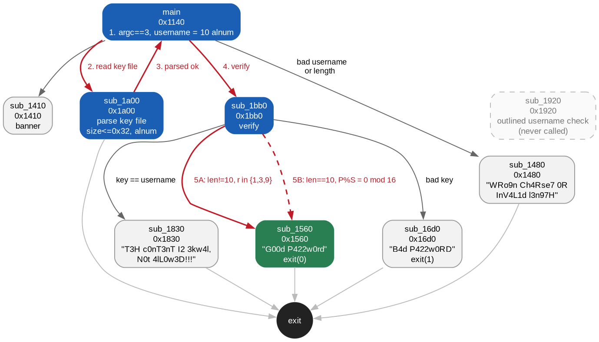

# Yet Another Keygenme/Crackme

"As the title tells, a keygenme challenge, but this time is a bit more complicated..."

- Category: rev
- Difficulty: 3.0
- Challenge author: BinaryNewbie
- Challenge link: [crackmes.one](https://crackmes.one/crackme/5d7c66d833c5d46f00e2c45b)
- Platform: Linux x86-64 (ELF PIE, dynamically linked, stripped)

There's no flag format — the goal is a keygen: given a username, produce a password the binary accepts. Usage is `./keygenme <username> <filepath>`, and the password is read from a *file* rather than stdin. The binary reports its verdict by overwriting that same file with `G00d P422w0rd` or `B4d P422w0RD`.

The "bit more complicated" turns out to be two separate things. The file ships with a deliberately corrupted ELF section header table, which is enough to make `file`, `readelf` and the decompiler all give up before any analysis starts. And the verifier contains two completely different checking algorithms, selected by whether the password length happens to equal the username length — so there are two independent ways to pass, one of which is far weaker than the other.

### Solution:

##### 1. A binary that won't parse

```
$ file keygenme
keygenme: ELF 64-bit LSB pie executable, x86-64, version 1 (SYSV), too many section (65535)
```

`readelf -h` shows where "65535" comes from, and it isn't one field but three:

```
Start of section headers:          65535 (bytes into file)
Number of section headers:         65535
Section header string table index: 65535 <corrupt: out of range>
readelf: Error: Reading 4194240 bytes extends past end of file for section headers
```

`e_shoff`, `e_shnum` and `e_shstrndx` have all been set to `0xFFFF`. The file is only 14312 bytes, so a section table at offset 65535 is past EOF. The program headers are untouched — the kernel loader never reads the section table, which is why the binary still *runs* perfectly while every analysis tool refuses it.

The textbook repair for a wrecked section table is to zero all three fields and work from program headers alone. That makes the file parse:

```
$ file keygenme-fixed
ELF 64-bit LSB pie executable, x86-64, ... dynamically linked, ... no section header
```

but it doesn't get analysis anywhere:

```
$ kuna functions ./keygenme-fixed --json
{ "binary": "./keygenme-fixed", "count": 0, "functions": [] }
```

Zero functions, and turning on discovery (`--option listing on --option aif on --option funcstart_patterns on`) still returns zero. A short function list has two usual causes — packing, or a discovery failure — but this is neither. The program headers show ordinary separate `R E` and `RW` `PT_LOAD` segments with `p_filesz == p_memsz`, so nothing is packed. The decompiler simply has no `.text` to look at, because it was told there are no sections.

##### 2. Recovering the real section table

Only the *pointer* was clobbered. Section header tables are conventionally the last thing in an ELF, so the table itself should still be sitting at the end of the file. Dumping the tail shows the `.shstrtab` strings and then what is obviously a table:

```
00003030: 2e30 0000 2e73 6873 7472 7461 6200 2e69  .0...shstrtab..i
00003040: 6e74 6572 7000 2e6e 6f74 652e 676e 752e  nterp..note.gnu.
...
00003160: 0000 0000 0000 0000 0b00 0000 0100 0000  ................
00003170: 0200 0000 0000 0000 a802 0000 0000 0000  ................
00003180: a802 0000 0000 0000 1c00 0000 0000 0000  ................
```

The entry at `0x3168` reads `sh_name=0x0b`, `sh_type=1` (`PROGBITS`), `sh_flags=2` (`ALLOC`), `sh_addr=sh_offset=0x2a8`, `sh_size=0x1c` — exactly the `INTERP` segment from the program headers, so that's `.interp`, section index 1. A 64-bit section header is 64 bytes, so the mandatory all-zero `SHT_NULL` entry at index 0 begins at `0x3168 - 64 = 0x3128`.

That single number confirms itself. The file is `0x37E8` bytes, and

```
0x37E8 - 0x3128 = 0x6C0 = 1728 = 27 x 64
```

lands exactly on a whole number of entries ending precisely at EOF — which is what an intact table looks like. `.shstrtab` is the last section (index 26), and its data starts at `0x3033`, matching the leading NUL before `.shstrtab` in the dump above.

Writing the three recovered values into a scratch copy — never the original:

```python
with open("keygenme-fixed", "r+b") as f:
    f.seek(0x28); f.write(struct.pack("<Q", 0x3128))  # e_shoff
    f.seek(0x3C); f.write(struct.pack("<H", 27))      # e_shnum
    f.seek(0x3E); f.write(struct.pack("<H", 26))      # e_shstrndx
```

```
$ kuna functions ./keygenme-fixed --json | head -3
{ "binary": "./keygenme-fixed", "count": 35, ...
```

All 27 sections come back with correct names, `.text` is at `0x1140`–`0x1ef1` (`0xdb1` bytes), and the function count goes from 0 to 35.

##### 3. `main`, and what it demands of the input

The binary is stripped, so `main` isn't named — but the first function in `.text` opens with `cmp $0x3,%edi`, which is an `argc` check, and it's the one `__libc_start_main` was handed:

```c
unsigned long sub_1140(int a0, unsigned long *a1)   // main
{
  if (a0 != 3) {
    __fprintf_chk(stderr, 1, "Usage %s <username> <filepath>\n", *a1);
    return 1;
  }
  ...
  v5 = malloc(0x18);           // username struct { char *ptr; size_t len; char ok; }
  v6 = malloc(0x20);           // file struct { char *buf; size_t len; char *path; char ok; }
  ...
  if (&v7[0xffffffffffffffff - (long)v2] == (char *)0xa) {      // strlen(username) == 10
      v4 = *__ctype_b_loc();
      if (... (v4 + v2[0]*2) & 8 ... && ... (v4 + v2[9]*2) & 8 ...) {   // all 10 alnum
        v6 = sub_1a00(v6);                                             // parse the file
        if (*(char *)&v6[3]) {
          sub_1bb0(v5, v6);   // verify, no-return
```

The `__ctype_b_loc()` table is `unsigned short *`, and indexing it as a byte pointer at `c*2` reads the low half of the entry; mask `8` is `_ISalnum`. So the username must be **exactly 10 alphanumeric characters**.

`sub_1a00` handles the key file: `fopen(path,"r")`, seek to end, `ftell` for the size, `malloc`, `fread`. Its constraints are

- size must be non-zero, and `size <= 0x32` (50);
- the whole read must succeed (`fread` returns `size`);
- bytes `0 .. size-2` must all be alnum — the **last byte is skipped**, so the file is "key + one trailing byte", conventionally a newline;
- the recorded key length is `size - 1`.

##### 4. Four XOR-obfuscated verdicts

None of the outcome strings are in `.rodata` as text. Instead there are tables of 32-bit words that get pushed onto the stack and XORed on the way out, and two smaller tables written to the key file a byte at a time. Four different keys, one per outcome:

```python
# sub_1480 / sub_1830: printf("%c", word ^ K) over a stack-built dword table
"".join(chr(v ^ 0xf0d1d0) for v in dwords(0x21b0, 28) + [0xf0d1e9, 0xf0d1e7, 0xf0d198])
"".join(chr(v ^ 0xc0ffee) for v in dwords(0x2280, 36))
# sub_1560 / sub_16d0: low byte of each dword, ^ 0xee, fwrite() into the key file
"".join(chr(data[0x2220 + 4*i] ^ 0xee) for i in range(12)) + "d\n"
"".join(chr(data[0x2250 + 4*i] ^ 0xee) for i in range(12)) + "\n"
```

```
sub_1480 (^0xf0d1d0):  WRo9n Ch4Rse7 0R InV4L1d l3n97H
sub_1830 (^0xc0ffee):  T3H c0nT3nT I2 3kw4l, N0t 4lL0w3D!!!
sub_1560 (^0xee):      G00d P422w0rd        <- success, exit(0)
sub_16d0 (^0xee):      B4d P422w0RD         <- failure, exit(1)
```

That names every exit from the verifier before reading a line of it: `sub_1560` is the win, `sub_16d0` is the loss, and `sub_1830` rejects a key identical to the username.

##### 5. Two checks, not one

`sub_1bb0(username, keyfile)` branches immediately on a length comparison, and the two sides share no code at all:

```c
v23 = a0[1];   // username length, always 10
v7  = a1[1];   // key length
if (v23 != v7) { ... }   // branch A
else           { ... }   // branch B
```

**Branch A** (`len(key) != 10`) runs a nested loop over key x username, accumulating a sum `S` and a wrapping 64-bit product `P`:

```c
v4  = (user[i] + (pw[j] ^ i)) & 0xf;      // i is the inner index
S  += 2 * v4;
v11 = (i ^ j) | (pw[j] + i);
P  *= (v4 | v11);
...
v23 = (P - S) % (S + P);
if ((!(int)(9 % (v23 & 0xf))) && (v23 & 0xf)) sub_1560(a1);   // win
```

The win condition is `r = ((P - S) % (P + S)) & 0xf` with `9 % r == 0` and `r != 0` — that is, **`r` must be 1, 3 or 9**. Three values out of sixteen, which is a hit rate around 19% for an arbitrary key.

**Branch B** (`len(key) == 10`) first rejects `key == username` via `sub_1830`, then runs a different construction that uses only `pw[0..8]` — the tenth key byte is ignored entirely:

```c
t[k]  = (pw[k] ^ user[i] ^ k) & 0xf;      // k = 0..8
v16   = (user[i] + i) ^ i;
S    += sum(t);
P    *= product(t[k] | v16 for k in 0..8);
...
if (!((P % S) * 5 & 0xf)) sub_1560(a1);   // win
```

`(P % S) * 5 == 0 (mod 16)` and `gcd(5,16) = 1`, so this needs `P % S` to be a multiple of 16 — a 1-in-16 condition on a value that is far harder to steer.

Branch A is plainly the weaker one, and it's also the one that admits short keys: any length except 10 qualifies, including **1**.

Nine user functions in total, and the whole program fits in one picture:



The graph is built from kuna's own output rather than a second disassembler. `decompile-all --json` carries the decompiled C for every function in its `code` field, so scanning each body for the names of other functions yields the call edges directly — a short pass over the JSON that emits DOT for Graphviz to lay out:

```bash
kuna decompile-all ./keygenme-fixed --json > all.json
# scan each function's "code" for callee names -> callgraph.dot
dot -Tpng -Gdpi=140 callgraph.dot -o callgraph.png
```

radare2 draws the same shape in one step — `r2 -A ./keygenme-fixed`, then `agCd` — on the header-repaired copy, and that's the quicker route if the picture is all you want. It does drop one node, though. `r2 -A` lists 30 functions to kuna's 35, and `sub_1920` is not among them: it's an outlined copy of the 10-character alnum username check that `main` performs inline, and nothing in the file references it — no call, no jump, and no 4- or 8-byte word anywhere holding `0x1920`. r2 discovers functions by following cross-references, so an unreferenced one is invisible to it, while kuna's pattern-based discovery finds it regardless. Dead code the compiler emitted and never wired up, which is why it's drawn dashed.

##### 6. Keygen, and checking the model instead of trusting it

Reimplementing branch A in Python with explicit `mod 2**64` wrapping and searching alphanumeric keys shortest-first finds a single-character key for essentially every username. Before believing any of it, though, the model is worth differential-testing against the real binary — the two accumulator expressions depend on C precedence subtleties (`a + (b ^ i) & 0xf` is `(a + (b ^ i)) & 0xf`, not `a + ((b ^ i) & 0xf)`), and getting either wrong would still produce plausible-looking keys.

Running 300 random username/key pairs through both the model and the binary, across all four outcomes:

```
300/300 match; outcome distribution: {'BAD': 240, 'EQUAL': 16, 'SIGFPE': 25, 'GOOD': 19}
```

That third outcome is a genuine bug in the crackme rather than a modelling artefact. The success test evaluates `9 % (v23 & 0xf)` *before* the `&& (v23 & 0xf)` guard that was presumably meant to prevent it, so any key whose result nibble is 0 divides by zero and the binary dies on `SIGFPE` — about 1 run in 16. The model predicts exactly which inputs do it.

With the model confirmed, the keygen is a shortest-first search:

```
$ ./keygen.py BinaryNewb
1
$ printf '1\n' > key.txt && ./keygenme BinaryNewb key.txt
...
[+] Let's verify...
[+] Status:
[+] Username is: BinaryNewb
[+] File content is: 1
[+] Check your file "key.txt"
$ cat key.txt
G00d P422w0rd
```

Across 40 random usernames plus edge cases, both modes verified 83/83 against the pristine, unmodified binary — no patching and no debugger at any point.

##### 7. Branch B is impossible for some usernames

Generating a 10-character key via branch B works for most usernames but fails outright for `aaaaaaaaaa` and `QQQQQQQQQQ`, no matter how long the search runs. That's not the search giving up — the branch is unsatisfiable for those inputs, and the parity argument is short:

- `v16 = (u + i) ^ i` always has the **same parity as `u`**, since the low bit of `(u + i)` is `u0 ^ i0` and XORing `i0` back gives `u0`. A factor `(t | v16)` can only be even if `v16` is even, so a username with every byte odd forces every factor odd, and therefore `P` odd — whatever the key is.
- `S`'s parity is `sum over i,k of (pw[k] ^ u_i ^ k) mod 2`, and since XOR on bits is addition mod 2 that is `10*sum(p_k) + 9*sum(u_i) + 10*sum(k) = sum(u_i) (mod 2)`. So **`S` is odd iff an odd number of username bytes are odd** — and an all-odd 10-byte username gives an even count, hence `S` even.
- `P` odd with `S` even means `P = qS + r` has `r` odd, so `P % S` is odd and can never be `0 mod 16`.

Sampling confirms it: for `aaaaaaaaaa`, `QQQQQQQQQQ` and `aQaQaQaQaQ` (all-odd, and the last not even constant), `P` was odd in 20000/20000 trials and `S` even in 20000/20000, with zero solutions; for `BinaryNewb` the same sample found 1271. The keygen detects the condition up front and says so rather than searching forever. Branch A is unaffected and always succeeds, which is why it's the default.

**Keygen:** `python3 keygen.py BinaryNewb` -> key `1` (`G00d P422w0rd`); `--len10` gives the 10-character variant `4RcQ7SKKmw`

### Takeaways

"Too many sections" is a claim about one field, not a verdict on the file. The standard repair — zero `e_shoff`/`e_shnum`/`e_shstrndx` and work from program headers — makes the ELF *load*, but it throws away the section table for good, and a decompiler with no `.text` returns zero functions no matter how much function discovery you turn on. Since section header tables are conventionally the last thing in the file, the real one is usually still there: find any recognisable entry (cross-checking `sh_offset`/`sh_size` against a known segment identifies it), divide back to the `SHT_NULL` entry, and confirm the guess by checking that `(filesize - e_shoff)` is an exact multiple of 64 that ends at EOF. Two arithmetic checks turned a zeroed-out fallback into a fully-symbolised binary.

Differential-test a reimplemented check before trusting the keys it produces. Both accumulators here hinge on C precedence — `a + (b ^ i) & 0xf` binds as `(a + (b ^ i)) & 0xf` because `&` is weaker than `+` — and a misreading still yields keys that *look* right while failing. Running a few hundred random inputs through both the model and the binary and comparing outcomes catches that in seconds. It also surfaced the crackme's own `SIGFPE` bug: `9 % r` is evaluated before the `r != 0` guard meant to protect it, so one run in sixteen crashes instead of printing a verdict, and the model predicting *which* inputs crash was the strongest evidence it was byte-exact.

When a check forks into two algorithms, the fork itself is the vulnerability. The length comparison here selects between an easy condition (result nibble in `{1, 3, 9}`, ~19% of arbitrary keys, satisfiable with a single character) and a hard one (`P % S` a multiple of 16, over a product the input barely steers). Nothing forces you into the branch the author clearly spent effort on — enumerating the exits first, which the XOR-obfuscated verdict strings made cheap, showed both paths reach the same `sub_1560` win.

Prove impossibility instead of searching forever. When branch B refused to produce a key for certain usernames, parity settled it: `(u + i) ^ i` preserves `u`'s parity, so an all-odd username makes the product odd, while `S`'s parity reduces to the count of odd username bytes and comes out even — and an odd number modulo an even one is never a multiple of 16. Two lines of algebra turned an unbounded search into a precise precondition the keygen can check up front.
