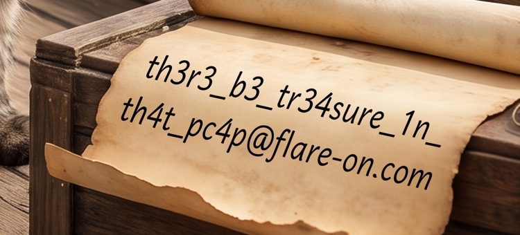

# CatThief

- Category: rev

"One of our stray laboratory felines just pilfered classified contraband from the server room... We've tossed the culprit's executable and a network packet capture into your enclosure so you can reconstruct the heist. Recover what the cat dragged out."

`catthief.exe` is a Rust C2 implant; `capture.pcapng` is the exfil traffic. The stolen files are uploaded RC4-encrypted **and** run through the challenge's own custom compressor (`compress.rs`), so decrypting the pcap is only half the job — the real work is reversing a bespoke Huffman format with no off-the-shelf decompressor. The flag isn't a string in the traffic; it's written on a scroll *inside* one of the recovered images.

### Solution

##### 1. The C2 protocol

catthief beacons over plain HTTP `POST /exfil` to `192.168.56.102:8080`. The server replies with a filename to steal; catthief reads that file and POSTs it back. The capture holds one manifest/beacon, five ~3 MB file uploads, and five server responses. Each message is an independent RC4 stream (fresh key schedule per message).

##### 2. The cipher is RC4

The encrypt/keystream routines (`sub_1400052e2` = KSA, `sub_140005281` = PRGA) are byte-for-byte standard RC4. `main` builds the 25-byte key by concatenating `data_1400c9010` (16 B) ‖ `0x0407576c41004a6c` (8 B) ‖ `0x07` (1 B) and XORing every byte with `0x33`, giving:

```
i11_b3_p1und3r1n_y3r_d474      ("ill be plundering yer data")
```

This is confirmed by decrypting the server responses — they come out as the exact stolen filenames (`important.jpg`, `anothercat.jpg`, `yetanothercat.jpg`, `catcatcat.jpg`, `myfavoritecat.jpg`).

##### 3. The wall: a custom compressor

RC4-decrypting the upload bodies does **not** yield JPEGs, and the payload is not gzip/zlib/deflate/zstd/lzma/bz2/brotli — it is the challenge's own `compress.rs`, fully inlined into `main`. In the HLIL, two loops read a string of `'0'`/`'1'` characters (via a UTF-8 reader `sub_140001329` that returns the `0x110000` sentinel at end-of-input) and pack them MSB-first into bytes (`sub_140079c3d`); a bit-writer `sub_1400053fe(vec, val, nbits)` emits two length headers and a byte-copy `sub_140005457` appends the sections. That is a transmitted-tree Huffman coder.

##### 4. Reversing the format with a known-plaintext oracle

Rather than fully statically model it, I ran `catthief.exe` in a VM against a listener that answered the beacon with a target path I controlled, fed it a **known JPEG**, captured the upload, and RC4-decrypted it. Matching the output against the input's byte statistics (and confirming with an exact round-trip) pins the format down to one contiguous MSB-first bitstream:

```
 11 bits : tree_len   (bytes in the code-length table; always 256)
 32 bits : data_len   (bytes in the Huffman bitstream)
256 bytes: code length for each symbol 0..255   (0 = symbol absent)
data_len bytes: canonical (DEFLATE-style) Huffman codes, MSB-first
```

The tree is just the 256 per-symbol code lengths; codes are rebuilt canonically (assign increasing codes in order of length, then symbol value). Decoding stops when the data section is consumed.

##### 5. Recover the images

RC4-decrypt each body, parse the header, rebuild the canonical tree from the 256 lengths, decode the bitstream, and trim at the JPEG `ff d9`. All five uploads recover as valid 2816×1536 pirate-cat JPEGs. Full pipeline: [`solve.py`](solve.py).

The flag is written on a scroll in the fourth image (`myfavoritecat.jpg`):



**Flag:** `th3r3_b3_tr34sure_1n_th4t_pc4p@flare-on.com`
