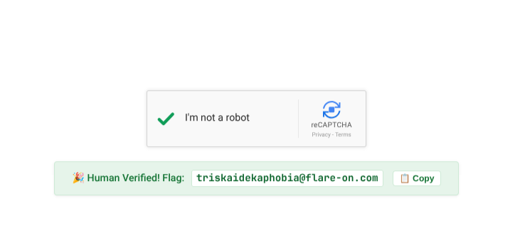

# FLAreCAPTCHA

- Category: rev

"Hello and welcome to the FLARE-On 13. This first stage challenge is designed to be easy to solve by a human or a robot, assuming the robot is as smart as a human. Are you as smart as a human? How many AI tokens are you going to burn to find out the answer to that question?"

There is no binary. The challenge is `flarecaptcha.html`, a fake reCAPTCHA v2 checkbox, and the flag is built in the page's own JavaScript. Every input to the decryption key comes from the page itself: which mouse button you press, how long you hold it, the page's charset, and the length of one function's source text.

### TL;DR

- Open challenge through python server (python3 -m http.server)
- Right-click and hold on the click box  
- Success banner will appears



### Solution

##### 1. Left-clicking is the trap

The checkbox's `mousedown` handler has two branches. A left click (`e.button === 0`) spins for a second and then calls `triggerFailure()`, which shows "Robot, or unskilled reverse engineer detected." The other branch is the one that prints the flag:

```js
// Ensure click occured in captcha box with 5,0 and 1,1 layout grids
if (e.button === (Math.pow(5, 0) + Math.pow(1, 1))) {
```

`5^0 + 1^1 = 2`, which is the **right** mouse button. The context menu is suppressed on the widget, and a `mouseup` with `button === 2` or a `mouseleave` before the 2000 ms `setTimeout` fires calls `cancelHold()`, which fails the check. So the human answer is to right-click the checkbox and hold it for 2 seconds.

##### 2. How the flag is built

The ciphertext is a 30-byte array, read through a `Proxy` that XORs every indexed read with the length of the page's charset:

```js
const recaptchaLogoBitmap = [123, 5, 102, 4, 100, 22, 102, 19, 106, 28, 110, 7, 103, 24, 109, 30, 110, 55, 105, 27, 110, 5, 106, 90, 96, 25, 33, 20, 96, 26];

get(target, prop) {
    if (typeof prop === 'string' && !isNaN(prop)) {
        const envShift = document.characterSet.length;   // "UTF-8" -> 5
        return target[prop] ^ envShift;
    }
```

When the 2-second timer fires, it derives a 16-bit key and XORs even-indexed bytes with its high byte and odd-indexed bytes with its low byte:

```js
const displayPaddingPx = Math.round((errorLogTime - errorLogStartTime) / 1000);   // hold time in s
const widgetLength = resetWidget.toString().length;
const widgetUpperBoundsPx = (displayPaddingPx * (widgetLength + 1115)) & 0xFFFF;
const wupperLeft  = (widgetUpperBoundsPx >> 8) & 0xFF;
const wupperRight = widgetUpperBoundsPx & 0xFF;
... b ^ (i % 2 === 0 ? wupperLeft : wupperRight)
```

The key depends on the environment. `resetWidget.toString()` returns the arrow function's source text with its whitespace, so a reformatted or minified copy of the page gives a different key. A page decoded as anything other than `UTF-8` changes the Proxy shift. In the original file `resetWidget` is 222 characters, so a 2-second hold gives `2 × (222 + 1115) = 2 × 1337 = 2674 = 0x0A72`.

##### 3. Brute-force the key instead of trusting the environment

The key is only 16 bits and Flare-On flags always end in `@flare-on.com`, so there's no need to model the timing. [`solve.py`](solve.py) applies the charset XOR, tries all 65,536 keys, and keeps the one whose plaintext has the known suffix:

```python
bitmap = [b ^ len("UTF-8") for b in bitmap]

for key in range(0x10000):
    hi, lo = key >> 8, key & 0xFF
    flag = "".join(chr(b ^ (hi if i % 2 == 0 else lo)) for i, b in enumerate(bitmap))
    if flag.endswith("@flare-on.com"):
        print(hex(key), flag)
```

```
$ python3 solve.py
0xa72 triskaidekaphobia@flare-on.com
```

Only one key matches, and it is `0x0A72`, the value derived from a 2-second hold in step 2. Holding a right-click on the checkbox in a browser for 2 seconds shows the same flag.

**Flag:** `triskaidekaphobia@flare-on.com`
