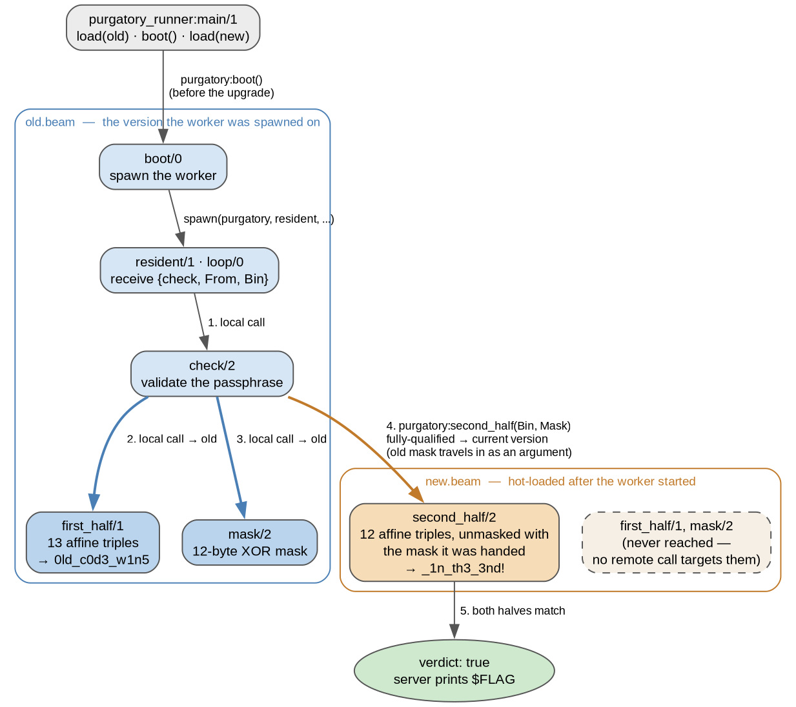

# purgatory

- Category: rev
- Difficulty: none
- Author: hoover

"We hot patched the validator during business hours. Nothing crashed, which is a good sign."

There is no native binary in the handout — just two BEAM modules and an Erlang runner. The whole challenge is hot code loading semantics: when two versions of a module are live at once, *which* version a running process actually executes, decided per call site.

### Solution:

##### 1. The runner leaves the worker straddling two versions

```erlang
run([OldPath, NewPath]) ->
    load(OldPath),
    Worker = purgatory:boot(),
    load(NewPath),
    io:put_chars("purgatory validator\n"),
    prompt(Worker).
```

`boot/0` spawns the worker while `old.beam` is current, and `new.beam` is loaded immediately after. Nothing ever purges the old code, so the worker carries on running it. That is the "nothing crashed" of the prompt, and the challenge name — the process is stuck between versions.

##### 2. Only the literals differ

```
AtU8 Code StrT ImpT ExpT FunT LitT Meta LocT Attr CInf Dbgi Line Type
                              ^^^^           ^^^^
Code : byte-identical between old.beam and new.beam
LitT : differs      (the constants)
Attr : differs      (module vsn hash)
```

Identical `Code` means both modules run the same algorithm over different constants. OTP 28 stores `LitT` uncompressed — flagged by a zero size prefix before the term count — so the literals decode without any zlib step:

- 13 tuples `{0..12, a, b, c}`
- 12 tuples `{13..24, a, b, c}`
- a 12-byte list

and the atom table names the algorithm outright:

```
first_half  second_half  mask  check  loop  resident
*  +  band  =:=  bxor  lists:nth  lists:all  binary:at  byte_size
```

So it is a 25-character passphrase, each byte checked as `(a * ch + b) band 255 =:= c`, with the trailing 12 characters XOR-masked before that check. Inverting is straightforward: every `a` is odd, hence invertible mod 256.

##### 3. The dispatch split decides which constants apply

The symbol tables say exactly which calls cross the version boundary:

```
LOCALS   check/2   mask/2   first_half/1   loop/0
IMPORTS  erlang:spawn/3 ... purgatory:second_half/2 ... lists:all/2
```

`first_half/1` and `mask/2` are local, so a process already running old code stays in old code to reach them. `purgatory:second_half/2` appears in the *import* table, which only happens for a fully-qualified call — and Erlang always routes those to the **current** version. Its arity is the other half of the story: it takes the binary *and* the mask, so a value computed by the old module travels into the new one as an argument.



Three components, three origins: old triples for the first half, **new** triples for the second, and the **old** mask.

##### 4. Every wrong dataflow is a planted taunt

Solving all the combinations makes the design obvious:

| first_half | second_half triples | mask | result |
|---|---|---|---|
| old | old | old | `0ld_c0d3_w1n5_c0d3x_ch34t` |
| new | new | new | `cl4ud3_ch34t5_a1_sl0p_l0l` |
| old | new | new | `0ld_c0d3_w1n5_a1_sl0p_l0l` |
| old | old | new | *garbage* |
| **old** | **new** | **old** | **`0ld_c0d3_w1n5_1n_th3_3nd!`** |

"codex cheat", "claude cheats", "AI slop lol" — the constant tables are salted so that every plausible-but-wrong reading still decodes to fluent, taunting text. Only the correct split reads as a sentence: *old code wins in the end*.

Full script: [solve.py](solve.py)

```
$ ncat --ssl purgatory-....chall.nnsc.tf 1337
purgatory validator
passphrase> 0ld_c0d3_w1n5_1n_th3_3nd!
NNS{sof7_PUr6e_woUlD_H4V3_reallY_5aV3D_yoU_tHer3}
```

**Flag:** `NNS{sof7_PUr6e_woUlD_H4V3_reallY_5aV3D_yoU_tHer3}`

### Takeaways

- Erlang dispatch is the entire vulnerability class: a local call stays in the version the process is already running, a fully-qualified `mod:fun()` jumps to the current one. With two versions live, "which code runs" is a property of each call site, not of the process.
- Arguments cross the boundary too, and arity is the tell. `second_half/**2**` takes the mask as a parameter, so the old module's data reaches the new module's code — a finer split than old-half/new-half, and the reason a first, coarser reading got rejected by the server.
- A decoy that decodes to *plausible text* is far more dangerous than one that decodes to garbage. Recovering a clean, meaningful string is not evidence the reading is right; here three separate wrong readings each produced a fluent taunt.
- The flag names the fix: `code:soft_purge/1` removes old code only when no process still references it, which would have turned this silent half-upgrade into a visible, all-or-nothing one.
